# Context Intelligence Framework Design Document
> Version: 5.0
> Date: 2026-02-22
> Author: 刘洪杰 (Hongjie Liu)

### Revision History

| Version | Date | Author | Change Description |
|---------|------|--------|-------------------|
| 1.0 | 2026-02-17 | 刘洪杰 (Hongjie Liu) | Initial version: overview, data classification, perception plugins, intent recognition, importance calculation, reward system, learning system |
| 2.0 | 2026-02-19 | 刘洪杰 (Hongjie Liu) | Encoders changed to probability distribution output; intent recognition rewritten: configurable rules -> auto-compiled decision tree -> soft matching -> LinUCB (semantic fusion) -> 5-layer robustness protection; added temporal rules, OR conditions, cooldown, decision tracing, template inheritance, dynamic thresholds; composite reward function |
| 3.0 | 2026-02-19 | 刘洪杰 (Hongjie Liu) | Full document restructured following DDD 7-step method: Boundary -> Use Case -> Sub-domain -> Layer -> Architecture -> Narrow-down -> Entity; added system boundary definition, four problem domain partitioning, six-layer architecture model, execution domain design, implementation roadmap |
| 4.0 | 2026-02-20 | 刘洪杰 (Hongjie Liu) | C++ NAPI migration implementation (4 new modules); context.test remote testing capability; 21-scenario full coverage test suite; cooldown loadRules fix; actual directory structure update |
| 5.0 | 2026-02-22 | 刘洪杰 (Hongjie Liu) | LLM fallback rule feedback loop (pending -> promote/remove); rule deduplication mechanism; recommendation anti-duplication; active exploration mode design; FeedbackService card lifecycle; merged context_awareness_design.md (collection strategy, geofence learning, app learning, silent mode enhancement, wearable integration, data tray, training sync, feedback learning) |

---

## Table of Contents

- [1. Boundary — Problem Boundary](#1-boundary--problem-boundary)
  - [1.1 What Context Intelligence Is](#11-what-context-intelligence-is)
  - [1.2 What Context Intelligence Is Not](#12-what-context-intelligence-is-not)
  - [1.3 System Boundary Diagram](#13-system-boundary-diagram)
  - [1.4 Input Boundary](#14-input-boundary)
  - [1.5 Output Boundary](#15-output-boundary)
  - [1.6 Privacy Boundary](#16-privacy-boundary)
- [2. Use Case — Scenarios and Use Cases](#2-use-case--scenarios-and-use-cases)
  - [2.1 Physical World Data Sources](#21-physical-world-data-sources)
  - [2.2 Digital World Data Sources (by Maslow's Hierarchy of Needs)](#22-digital-world-data-sources-by-maslows-hierarchy-of-needs)
  - [2.3 Core Use Case List](#23-core-use-case-list)
  - [2.4 Use Case Priorities](#24-use-case-priorities)
- [3. Sub-domain — Problem Domain Partitioning](#3-sub-domain--problem-domain-partitioning)
  - [3.1 Four Major Problem Domains](#31-four-major-problem-domains)
  - [3.2 Perception Domain](#32-perception-domain)
  - [3.3 Decision Domain](#33-decision-domain)
  - [3.4 Execution Domain](#34-execution-domain)
  - [3.5 Learning Domain](#35-learning-domain)
  - [3.6 Inter-domain Interactions](#36-inter-domain-interactions)
- [4. Layer — Layered Architecture](#4-layer--layered-architecture)
  - [4.1 Six-Layer Model](#41-six-layer-model)
  - [4.2 Layer Responsibilities and Languages](#42-layer-responsibilities-and-languages)
  - [4.3 Inter-layer Dependency Rules](#43-inter-layer-dependency-rules)
- [5. Architecture — Architecture Design](#5-architecture--architecture-design)
  - [5.1 Perception Domain Architecture](#51-perception-domain-architecture)
  - [5.2 Decision Domain Architecture](#52-decision-domain-architecture)
  - [5.3 Execution Domain Architecture](#53-execution-domain-architecture)
  - [5.4 Learning Domain Architecture](#54-learning-domain-architecture)
  - [5.5 Full Data Flow Panorama](#55-full-data-flow-panorama)
- [6. Narrow-down — Technical Key Points](#6-narrow-down--technical-key-points)
  - [6.1 Decision Tree Auto-compilation](#61-decision-tree-auto-compilation)
  - [6.2 Soft Matching Strategy](#62-soft-matching-strategy)
  - [6.3 LinUCB Algorithm Details](#63-linucb-algorithm-details)
  - [6.4 Robustness Detailed Design](#64-robustness-detailed-design)
  - [6.5 Temporal Rules](#65-temporal-rules)
  - [6.6 Cooldown + Merged Push](#66-cooldown--merged-push)
  - [6.7 Cold Start Strategy](#67-cold-start-strategy)
  - [6.8 On-device Training Approach](#68-on-device-training-approach)
- [7. Entity — Implementation Design](#7-entity--implementation-design)
  - [7.1 Core Data Structures](#71-core-data-structures)
  - [7.2 C++ Module Design](#72-c-module-design)
  - [7.3 NAPI Interface Definitions](#73-napi-interface-definitions)
  - [7.4 ArkTS Service Design](#74-arkts-service-design)
  - [7.5 Storage Design](#75-storage-design)
  - [7.6 Directory Structure](#76-directory-structure)
  - [7.7 Implementation Roadmap](#77-implementation-roadmap)
- [8. Implementation Record — C++ NAPI Migration](#8-implementation-record--c-napi-migration)
  - [8.1 Migration Principles](#81-migration-principles)
  - [8.2 New C++ Modules](#82-new-c-modules)
  - [8.3 ArkTS Wrapper Layer](#83-arkts-wrapper-layer)
  - [8.4 Fixed Issues](#84-fixed-issues)
  - [8.5 Actual Directory Structure](#85-actual-directory-structure)
- [9. Test Suite](#9-test-suite)
  - [9.1 Test Architecture](#91-test-architecture)
  - [9.2 Test Scenario List](#92-test-scenario-list)
  - [9.3 Test Results](#93-test-results)
- [10. LLM Fallback Rule Feedback Loop](#10-llm-fallback-rule-feedback-loop)
  - [10.1 Design Goals](#101-design-goals)
  - [10.2 Rule Lifecycle](#102-rule-lifecycle)
  - [10.3 Pending Rule Storage](#103-pending-rule-storage)
  - [10.4 Feedback-driven Promotion/Demotion](#104-feedback-driven-promotiondemotion)
  - [10.5 Recommendation Anti-duplication](#105-recommendation-anti-duplication)
- [11. Rule Deduplication Mechanism](#11-rule-deduplication-mechanism)
  - [11.1 Deduplication Strategy](#111-deduplication-strategy)
  - [11.2 Deduplication Timing](#112-deduplication-timing)
- [12. Active Exploration Mode](#12-active-exploration-mode)
  - [12.1 Design Philosophy](#121-design-philosophy)
  - [12.2 Workflow](#122-workflow)
  - [12.3 State Fingerprint](#123-state-fingerprint)
  - [12.4 Differences from Normal Mode](#124-differences-from-normal-mode)
- [13. Multi-level Collection Strategy (Power Optimization)](#13-multi-level-collection-strategy-power-optimization)
  - [13.1 CellID Location Change Detection](#131-cellid-location-change-detection)
  - [13.2 Collection Interval Configuration](#132-collection-interval-configuration)
  - [13.3 Motion State Detection](#133-motion-state-detection)
  - [13.4 Phone Pickup Detection](#134-phone-pickup-detection)
- [14. Geofence Feature Learning](#14-geofence-feature-learning)
  - [14.1 Data Structure](#141-data-structure)
  - [14.2 Learning Trigger and Feature Matching](#142-learning-trigger-and-feature-matching)
- [15. App Usage Record Learning](#15-app-usage-record-learning)
- [16. Silent Mode Enhancement](#16-silent-mode-enhancement)
  - [16.1 Key Information Extraction](#161-key-information-extraction)
  - [16.2 Emotion/Mood Detection](#162-emotionmood-detection)
- [17. Wearable Device Integration](#17-wearable-device-integration)
- [18. Data Tray Specification](#18-data-tray-specification)
- [19. Training Data Sync System (C++)](#19-training-data-sync-system-c)
  - [19.1 Architecture Overview](#191-architecture-overview)
  - [19.2 C++ Data Structures](#192-c-data-structures)
  - [19.3 NAPI Interface](#193-napi-interface)
  - [19.4 Data Flow](#194-data-flow)
  - [19.5 Server-side Interface](#195-server-side-interface)
- [20. Feedback Learning System Detailed Design](#20-feedback-learning-system-detailed-design)
- [Appendix: TODO Items](#appendix-todo-items)

---

## 1. Boundary — Problem Boundary

### 1.1 What Context Intelligence Is

An **AI secretary** embedded in the phone that can:
- **Perceive** — Collect data from the physical world and digital world
- **Understand** — Know the user's needs and intentions
- **Act** — Provide assistance at the right moment

**Core Principles:**

| Principle | Description |
|-----------|-------------|
| **Independent Personality** | AI is a companion, not a subordinate; has its own opinions and boundaries |
| **Privacy First** | Users control what AI can see; minimum permissions by default |
| **Local First** | Personal data never leaves the device; learning is done locally |
| **Progressive Intelligence** | From rules to models to LLM, upgrading complexity as needed |

### 1.2 What Context Intelligence Is Not

| Not | Description |
|-----|-------------|
| Not a general AI assistant | Does not handle user-initiated conversations/Q&A (that's the ClawdBot main body's job) |
| Not a notification manager | Not just filtering/forwarding notifications, but proactively providing services after understanding the context |
| Not a background service | Not continuously polling all data, but event-driven + on-demand queries |
| Not a cloud system | Core decisions are made locally; cloud is only used for LLM fallback and model delivery |

### 1.3 System Boundary Diagram


**Boundary Definitions:**
- **Boundary with Chat UI**: User actively sends a message -> Chat UI handles it; context intelligence proactively pushes -> via notifications/cards/voice
- **Boundary with OpenClaw Gateway**: Context intelligence only calls Gateway at Layer 3 (LLM fallback); daily decisions are purely local
- **Boundary with HarmonyOS**: Context intelligence obtains sensor data and sends notifications via system APIs; does not modify system behavior

### 1.4 Input Boundary

```
Inputs received by context intelligence:
├── Physical world events (sensor-triggered)
│   ├── Location changes (GPS/WiFi/Bluetooth)
│   ├── Motion state changes (accelerometer)
│   ├── Environmental changes (light/noise/temperature)
│   └── Phone state changes (charging/battery/connectivity)
│
├── Digital world events (system notifications)
│   ├── New message notifications (IM/email/SMS)
│   ├── App notifications (food delivery/courier/bank)
│   ├── Calendar event reminders
│   └── System events (incoming calls/alarms)
│
└── User feedback (explicit + implicit)
    ├── Click/ignore/swipe away notifications
    ├── Say "thanks" / "don't bother me"
    └── Manually configure rules
```

### 1.5 Output Boundary

```
Outputs produced by context intelligence:
├── User notifications (primary output)
│   ├── System notification bar (fullscreen/banner/badge/silent)
│   ├── Voice broadcast (driving mode)
│   ├── Cards (rich media information)
│   └── Merged summaries (batch information digest)
│
├── Silent actions (non-intrusive)
│   ├── Pre-cache data (pre-load weather/traffic)
│   ├── Adjust system settings (mute/brightness)
│   └── Background preparation (organize schedule summary)
│
└── Feedback to learning system
    ├── Decision trace records
    └── Reward signals (for LinUCB)
```

### 1.6 Privacy Boundary

| Level | Symbol | AI Visible Content | Description |
|-------|--------|-------------------|-------------|
| **Open** | 🟢 | Full original text | AI has full visibility |
| **Summary** | 🟡 | Summary + metadata | AI only sees overview, not original text |
| **Forbidden** | 🔴 | Only "new message" | AI has no visibility |
| **Authorized** | 🔵 | Temporary full access | Visible after user authorization, revoked after use |

**Privacy Principles:**
1. Minimum permissions by default (new data sources default to 🔴)
2. User-initiated authorization
3. Temporary authorization auto-revokes
4. Summary level only provides statistics, not original text
5. Audit logs are available for review

---

## 2. Use Case — Scenarios and Use Cases

### 2.1 Physical World Data Sources

#### Human

| Subcategory | Data | Source |
|-------------|------|--------|
| **Vital Signs** | Heart rate, HRV, blood pressure, SpO2, body temperature | Watch/band |
| **Motion State** | Stationary (sitting/standing/lying), walking, running, cycling, riding in vehicle | Accelerometer |
| **Body Attributes** | Height, weight, body fat, age, gender | User profile |
| **Mental State** | Sleep quality, fatigue, stress, emotion | Inferred/self-reported |
| **Biometrics** | Voiceprint, face, fingerprint | Sensors |

#### Phone

| Subcategory | Data |
|-------------|------|
| **Posture** | Grip style, screen orientation |
| **Location** | GPS coordinates, place type (home/office/mall) |
| **Power** | Battery level, charging status |
| **Connectivity** | WiFi, Bluetooth, signal strength |
| **Time** | Time of day, day of week, holidays |

#### Environment (Five Senses)

| Sense | Data | Source |
|-------|------|--------|
| **Sight** | Light level, scene, people, objects | Camera/light sensor |
| **Hearing** | Noise level, ambient sound type, voice | Microphone |
| **Smell** | Air quality, PM2.5 | Sensor/API |
| **Taste** | (Indirect inference) | Scene + time |
| **Touch** | Temperature, humidity, atmospheric pressure | Environmental sensors |

### 2.2 Digital World Data Sources (by Maslow's Hierarchy of Needs)

| Level | Data | Privacy | Source |
|-------|------|---------|--------|
| **1. Physiological** | Food delivery/grocery orders | 🟢 | Meituan/Ele.me |
| | Health data trends | 🟡 | Health apps |
| | Medical diagnosis records | 🔴 | Medical apps |
| **2. Safety** | Courier/ride status | 🟢 | Courier/ride apps |
| | Bill reminders | 🟡 | Banking apps |
| | Financial details/passwords | 🔴 | Finance apps |
| **3. Social** | Public group chats | 🟢 | Social apps |
| | Private chat message summaries | 🟡 | IM apps |
| | Private conversation content | 🔴 | IM apps |
| **4. Esteem** | Tasks/schedule | 🟢 | Calendar/task apps |
| | Work document titles | 🟡 | Office apps |
| | Salary/performance | 🔴 | HR systems |
| **5. Self-actualization** | Public learning content | 🟢 | Learning platforms |
| | Learning progress | 🟡 | Learning apps |
| | Private diary | 🔴 | Note apps |

### 2.3 Core Use Case List

| Use Case | Trigger Condition | Action | Priority |
|----------|-------------------|--------|----------|
| Commute reminder | Weekday + 7:00 +/- 30min + at home | Push traffic + weather | 🟡 |
| Lunch recommendation | Weekday + 12:00 +/- 1h + at office | Push nearby restaurants/delivery | 🟢 |
| Important message | Spouse/boss sends message | Urgent notification | 🔴 |
| Low battery | Battery < 20% + not charging | Remind to charge | 🟡 |
| Bedtime summary | 22:00-24:00 + at home | Tomorrow's schedule + weather | 🟢 |
| Package arrival | Courier notification + at home | Remind to pick up | 🟢 |
| Exercise reminder | Sedentary > 2 hours | Suggest activity | 🟢 |
| Message pile-up | 3+ unread messages in 10 min | Merged reminder | 🟡 |
| Homebound traffic | Leaving office + getting in car | Broadcast traffic conditions | 🟡 |
| Sleep suggestion | 3 consecutive days using phone after 23:00 | Suggest going to bed earlier | 🟢 |
| Meeting preparation | 15 min before calendar event | Reminder + materials | 🟡 |
| Auto mute | Entering meeting room/cinema | Mute phone | ⚪ |

### 2.4 Use Case Priorities

| Phase | Use Cases | Reason |
|-------|-----------|--------|
| **MVP** | Commute reminder, important message, low battery, bedtime summary | Simple trigger conditions, high value |
| **Phase 2** | Lunch recommendation, message pile-up, meeting preparation, package arrival | Requires notification interception |
| **Phase 3** | Exercise reminder, sleep suggestion, auto mute, homebound traffic | Requires continuous sensors + temporal patterns |

---

## 3. Sub-domain — Problem Domain Partitioning

### 3.1 Four Major Problem Domains


### 3.2 Perception Domain

**Responsibility:** Collect raw data and encode it into structured probability distribution events

```
Input: Raw sensor data / System notifications / API data
Output: EncodedEvent (probability distribution + feature vector + data quality)

Sub-modules:
├── Plugin registration (category / classifier / encoder triad)
├── Physical world encoders (location/motion/environment -> probability distribution)
├── Digital world encoders (notifications/calendar/messages -> probability distribution)
└── Perception bus (event routing + privacy pre-filtering)
```

**Core Interface:** Probability distribution output (multi-label, normalization not required) + data quality score

### 3.3 Decision Domain

**Responsibility:** Based on the current context, decide what to do

```
Input: EncodedEvent + user context
Output: Decision (intent + confidence + action type + decision trace)

Sub-modules:
├── Rule configuration (user writes flat rules)
├── Decision tree compiler (auto-compilation + cost-aware sorting)
├── Soft matching engine (probability distribution -> multi-leaf confidence)
├── LinUCB policy (semantic fusion + action selection)
├── LLM fallback (scenarios not covered by decision tree)
├── Cooldown management
├── Temporal rule engine (event sequence matching)
└── Decision trace recording
```

**Core Algorithm:** Decision tree (soft matching) + LinUCB (semantic fusion + time decay)

### 3.4 Execution Domain

**Responsibility:** Transform decisions into concrete user-visible actions

```
Input: Decision
Output: User notifications / Voice broadcast / Silent actions

Sub-modules:
├── Privacy filter (last line of defense before execution)
├── Content generation (template filling / API assembly / LLM generation)
├── Form selection (fullscreen/banner/badge/voice/silent)
├── Timing scheduling (immediate/wait for unlock/wait for idle/merge)
├── Multi-modal output (text/card/voice/quick action)
└── Feedback collection trigger
```

**Core Strategy:** Urgency x User state -> Push form matrix

### 3.5 Learning Domain

**Responsibility:** Continuously improve decision quality from user feedback

```
Input: User feedback (explicit + implicit)
Output: Updated LinUCB parameters

Sub-modules:
├── Feedback collection (click/ignore/swipe away/thanks/don't bother me)
├── Reward calculation (base feedback + disturbance penalty + accuracy)
├── Anomaly detection (filter bad feedback)
├── LinUCB online update (time decay)
├── Checkpoint management (auto snapshots + rollback)
└── Performance monitoring (sliding window average reward)
```

**Core Mechanism:** 5-layer robustness protection + time-decay forgetting

### 3.6 Inter-domain Interactions


**Data Format Conventions:**
- Perception -> Decision: `EncodedEvent` (probability distribution + features + quality)
- Decision -> Execution: `Decision` (intent + confidence + action + trace)
- Execution -> Learning: `Feedback` (action_id + user response + delay)
- Learning -> Decision: Directly updates LinUCB internal parameters (A, b matrices)

---

## 4. Layer — Layered Architecture

### 4.1 Six-Layer Model


### 4.2 Layer Responsibilities and Languages

| Layer | Responsibility | Language | Reason |
|-------|---------------|----------|--------|
| UI Layer | User interaction interface | ArkTS | HarmonyOS UI must use ArkTS |
| Business Layer | Execution domain logic | ArkTS | Needs to call system APIs, UI rendering |
| NAPI Bridge | ArkTS <-> C++ | C++ | N-API standard |
| Engine Layer | Decision domain + Learning domain core | C++ | Performance, memory control, cross-platform |
| System Layer | Perception domain data sources | ArkTS -> C++ | System APIs use ArkTS, encoding uses C++ |
| External Services | LLM/API | HTTP | Network calls |

### 4.3 Inter-layer Dependency Rules

```
Upper layers can call lower layers ✅
Lower layers cannot call upper layers ❌ (use callbacks/events for notification)
Same-layer communication through interfaces ✅
Cross-layer calls prohibited (must go through adjacent layers) ❌
```

---

## 5. Architecture — Architecture Design

### 5.1 Perception Domain Architecture

#### Plugin Registration Triad


#### Encoder Output Specification

```typescript
interface EncodedOutput {
  distribution: Map<string, number>;  // Probability distribution (normalization not required)
  features: number[];                 // Feature vector
  summary?: string;                   // Text summary
  quality: number;                    // Data quality 0~1
}
```

#### Plugin Distribution Output Examples

| Plugin | Distribution Output | Description |
|--------|-------------------|-------------|
| Location | `{home:0.8, market:0.7, office:0.02}` | When GPS accuracy is poor, multiple locations have probabilities |
| Motion | `{still:0.6, walking:0.3, driving:0.1}` | At a red light, both stationary and driving are possible |
| Time Period | `{morning:0.9, commute:0.7}` | Non-mutually exclusive categories |
| Noise | `{quiet:0.4, office:0.5, cafe:0.3}` | Ambient sound is uncertain |

### 5.2 Decision Domain Architecture

#### Overall Flow


#### Rule Configuration

Users write flat rules, the system auto-compiles them into a decision tree:

```typescript
interface SmartRule {
  id: string;
  name: string;
  enabled: boolean;
  conditions: Map<string, RuleCondition>;       // AND relationship
  conditionGroups?: Map<string, RuleCondition>[]; // OR groups (optional)
  temporal?: TemporalCondition;                 // Temporal condition (optional)
  extends?: string[];                           // Template inheritance (optional)
  intent: string;
  priority: '🔴' | '🟡' | '🟢' | '⚪';
  action: string;
  cooldown?: CooldownConfig;
}
```

#### Decision Tree Auto-compilation

- Automatically builds tree by key, merging identical keys
- Cost-aware sorting: cheap checks (time, day of week) placed at upper levels, expensive ones (GPS, sensors) at lower levels
- Automatically recompiles when rules change

#### Soft Matching

- Each condition returns 0~1 confidence (not boolean)
- Missing data = 0.5 (unknown ≠ non-match)
- Key features like location use multi-source fusion (GPS + WiFi + Bluetooth + history)
- Decision tree can traverse multiple paths, confidence multiplied along paths
- Final responses graded by confidence level

#### LinUCB (Semantic Fusion)

A single global LinUCB with semantically fused state vector as input:

```
State = concat(
  raw_features,     // Raw perception features ~20 dimensions
  context_vector,   // Leaf node semantically weighted fusion ~10 dimensions
  history_features, // Push count/recent feedback ~10 dimensions
) -> Total ~40 dimensions

score(action) = θᵀx + α√(xᵀA⁻¹x)
Update: A = γA + xxᵀ, b = γb + rx (γ=0.998 time decay)
```

### 5.3 Execution Domain Architecture

#### Execution Pipeline

```plantuml
@startuml
start
:Decision (from Decision Domain);
:Privacy filter;
note right: 🔴 Block / 🟡 Desensitize\n🟢 Pass / 🔵 Request authorization
if (Privacy passed?) then (yes)
  :Content generation;
  note right: Template filling (<10ms)\nAPI assembly (100-500ms)\nLLM generation (500-2000ms)
  :Form selection;
  note right: Urgency x User state matrix
  :Timing scheduling;
  note right: Immediate / Wait for unlock\nWait for idle / Merged push
  :Multi-modal output;
  note right: Text + Card + Voice\n+ Quick action buttons
  :Begin feedback collection;
else (blocked)
  stop
endif
stop
@enduml
```



#### Push Form Matrix

```
            Idle        Busy        Meeting     Sleeping    Driving
🔴 Now     Full+sound  Banner+vib  Banner+vib  Full+sound  Voice
🟡 Soon    Banner      Badge       Silent      Silent      Voice
🟢 Later   Badge       Silent      Silent      Silent      Silent
⚪ Bg      Silent      Silent      Silent      Silent      Silent
```

Low confidence (<0.6) automatically downgrades one level (fullscreen -> banner -> badge -> silent).

#### Merged Push

Multiple 🟢/⚪ pushes within 5 minutes are merged into a single summary notification.

### 5.4 Learning Domain Architecture

#### Reward Calculation

```python
reward = base_reward              # Explicit/implicit feedback
       + disturbance_penalty      # -0.1 x (recent push count^1.5)
       + accuracy_bonus           # Correct push +0.5 / Should have pushed but didn't -1.0
```

Time-period weighting: sleeping x3, meeting x2, driving x2.5.

#### 5-Layer Robustness Protection

| Layer | Protection | Mechanism |
|-------|-----------|-----------|
| Input | Feature anomaly | Range check + missing value filling |
| Feedback | Abnormal feedback | 3σ detection + frequency limiting + reward clipping |
| Model | Parameter protection | Time decay γ + 5% change limit + condition number monitoring |
| Output | Uncertainty | Confidence check + fallback to rules when uncertain |
| System | Overall degradation | Daily checkpoints + performance monitoring + auto rollback |

#### Cold Start

| Phase | Rules | RL | Description |
|-------|-------|-----|-------------|
| First 2 weeks | 100% | 0% | Only collect data |
| Week 2 | 70% | 30% | Start participating |
| Week 4+ | 30% | 70% | Gradually hand over control |
| Stabilized | Fallback | Leading | Use rules when RL is uncertain |

### 5.5 Full Data Flow Panorama


---

## 6. Narrow-down — Technical Key Points

### 6.1 Decision Tree Auto-compilation

**Key Selection Strategy:** `score = coverage x discrimination / cost`

```typescript
const featureCosts: Record<string, number> = {
  'weekday': 1, 'hour': 1, 'charging': 1, 'battery': 1,  // Free
  'keyword': 2, 'sender': 2, 'app': 2,                    // Lightweight
  'location': 10, 'activity': 10,                         // Requires sensors
  'noise': 15, 'heartrate': 20,                           // Expensive
};
```

Cheap keys placed at upper levels -> early pruning -> avoids unnecessary sensor queries.

### 6.2 Soft Matching Strategy

**Time:** Gaussian decay, 1.0 within tolerance, exponential decay beyond
```
target=7:30, tolerance=30min:
7:30->1.0, 7:00->1.0, 6:50->0.85, 6:30->0.45, 6:00->0.05
```

**Location:** Multi-source fusion takes the highest
```
GPS (if available) + WiFi SSID (0.95) + Bluetooth devices (0.8) + Historical inference
-> max(scores)
```

**Missing data:** confidence=0.5 (neutral), not 0 (negative)

### 6.3 LinUCB Algorithm Details

```
Select action: score = θᵀx + α√(xᵀA⁻¹x)
Update:        A = γA + xxᵀ, b = γb + rx
Parameters:    d≈40, α=1.0, γ=0.998
Memory:        A(40x40) x 10 actions x 4 bytes ≈ 70KB
Update time:   <0.01ms
```

**Semantic Fusion:** Leaf nodes -> semantic vectors (auto-generated from rule conditions) -> weighted fusion by confidence -> one global LinUCB

**Exploration Strategy:** 🔴 urgent: no exploration; low risk + user idle: ε=0.2; otherwise ε=0.05

### 6.4 Robustness Detailed Design

**Time Decay:** γ=0.998, half-life ≈ 346 iterations (approximately 2 weeks), old habits automatically fade

**Anomaly Detection:** Reward deviates 3σ / >5 feedback entries within 1 minute / features out of range -> filter

**Rollback:** Daily snapshots; 30% performance drop -> auto restore checkpoint

### 6.5 Temporal Rules

```typescript
interface TemporalCondition {
  event: string;                              // Event type
  window: number;                             // Time window (ms)
  count?: { min?: number, max?: number };
  sequence?: string[];                        // Ordered event sequence
}
```

Implementation: Event ring buffer (last 7 days, max 10,000 entries), O(N) scan.

### 6.6 Cooldown + Merged Push

```typescript
interface CooldownConfig {
  duration: number;       // Minimum interval (ms)
  scope: 'rule' | 'intent';  // Dedup scope
  resetOn?: string;       // Reset event
  merge?: boolean;        // Merge during cooldown
}
```

### 6.7 Cold Start Strategy

MVP starts with statistical learning (average reward table per leaf node action), then upgrades to LinUCB.

### 6.8 On-device Training Approach

| Phase | Approach | Description |
|-------|----------|-------------|
| MVP | Statistical learning (no gradients needed) | Average reward table, argmax |
| Phase 2 | Hand-written C++ LinUCB | Matrix operations, <100 lines of code |
| Phase 3 | MindSpore Lite (if training is supported) | Huawei native |

---

## 7. Entity — Implementation Design

### 7.1 Core Data Structures

```typescript
// Rule
interface SmartRule {
  id: string;
  name: string;
  enabled: boolean;
  conditions: Map<string, RuleCondition>;
  conditionGroups?: Map<string, RuleCondition>[];
  temporal?: TemporalCondition;
  extends?: string[];
  intent: string;
  priority: string;
  action: string;
  cooldown?: CooldownConfig;
}

// Decision tree node
interface ExecNode {
  key: string;
  branches: Map<Object, ExecNode | LeafNode>;
  fallthrough?: ExecNode;
}

// Leaf node
interface LeafNode {
  rules: SmartRule[];
  semantic: number[];  // Semantic vector
}

// Match result
interface MatchResult {
  rule: SmartRule;
  confidence: number;
  path: { key: string, actual: Object, expected: Object, confidence: number }[];
}

// Decision output
interface Decision {
  intent: string;
  confidence: number;
  priority: string;
  action: string;
  actionParams: Record<string, string>;
  trace: DecisionTrace;
}

// Encoder output
interface EncodedOutput {
  distribution: Map<string, number>;
  features: number[];
  quality: number;
  summary?: string;
}
```

### 7.2 C++ Module Design

```cpp
// Rule compiler
class RuleCompiler {
  ExecNode* compile(vector<Rule>& rules);
  string selectBestKey(vector<Rule>& rules);
  SemanticVector generateSemantic(Rule& rule);
};

// Decision tree execution
class DecisionTree {
  vector<MatchResult> evaluateSoft(ExecNode* root, Context& ctx);
};

// Soft matcher
class SoftMatcher {
  float match(string key, Value actual, Value expected);
  float matchLocation(string target, LocationSources& sources);
  float matchHour(float actual, float target, float tolerance);
};

// LinUCB policy
class RobustLinUCB {
  int selectAction(VectorXf& x);
  void update(int arm, VectorXf& x, float reward);
  // Built-in: time decay, anomaly filtering, reward clipping
};

// Event buffer
class EventRingBuffer {
  void push(Event& e);
  int countInWindow(string event, int64_t windowMs);
  bool matchSequence(vector<string>& seq, int64_t windowMs);
};

// Cooldown manager
class CooldownManager {
  bool isInCooldown(string ruleId);
  void startCooldown(string ruleId, int64_t durationMs);
  void mergeEvent(string ruleId, Event& e);
};

// Decision tracer
class DecisionTracer {
  void record(vector<MatchResult>& results, Context& ctx);
  string getHistory(int limit);  // JSON
};

// Model checkpoint
class ModelCheckpoint {
  void save(RobustLinUCB& model);
  void maybeRollback(RobustLinUCB& model, float currentAvgReward);
};
```

### 7.3 NAPI Interface Definitions

```typescript
// Calling C++ engine from ArkTS
import ruleEngine from 'libruleengine.so';

// Rule management
ruleEngine.loadRules(rulesJson: string): boolean;
ruleEngine.compileTree(): boolean;

// Event input
ruleEngine.pushEvent(eventJson: string): void;

// Decision
ruleEngine.evaluate(contextJson: string): string;  // -> Decision JSON

// Feedback
ruleEngine.feedback(ruleId: string, reward: number): void;

// Tracing
ruleEngine.getTraceHistory(limit: number): string;  // -> JSON

// Model management
ruleEngine.saveModel(path: string): boolean;
ruleEngine.loadModel(path: string): boolean;
ruleEngine.resetModel(): boolean;
```

### 7.4 ArkTS Service Design

```typescript
// Context intelligence main service
class ContextAIService {
  // Initialize engine
  async init(): Promise<void>;

  // Event loop: receive perception events -> decide -> execute
  async onEvent(event: EncodedEvent): Promise<void>;

  // Execution pipeline
  async executeAction(decision: Decision): Promise<void>;
}

// Perception plugin manager
class PluginManager {
  registerPlugin(plugin: PerceptionPlugin): void;
  startAll(): void;
  stopAll(): void;
}

// Content generator
class ContentGenerator {
  async generate(intent: string, context: Context): Promise<ActionContent>;
}

// Feedback collector
class FeedbackCollector {
  watch(actionId: string): void;
  onUserResponse(actionId: string, response: UserResponse): void;
}
```

### 7.5 Storage Design

```
entry/src/main/resources/
└── rawfile/
    └── context_ai/
        └── default_rules.json     # Pre-set rule library

AppData/
└── context_ai/
    ├── rules/
    │   ├── user_rules.json        # User-defined rules
    │   └── templates.json         # Rule templates
    ├── model/
    │   ├── linucb_params.bin      # LinUCB parameters (~70KB)
    │   ├── action_stats.json      # Statistical learning data (MVP)
    │   └── checkpoints/           # Historical checkpoints
    ├── data/
    │   ├── event_buffer.bin       # Event ring buffer
    │   ├── feedback_log.db        # Feedback log
    │   └── decision_trace.db      # Decision trace (last 1000 entries)
    └── config/
        └── learning_config.json   # Learning parameters (γ, α, etc.)
```

Total storage: < 5MB

### 7.6 Directory Structure

**Design Target Directory (Planned):**

```
entry/src/main/
├── ets/
│   └── service/
│       └── contextai/
│           ├── ContextAIService.ets    # Main service
│           ├── PluginManager.ets       # Plugin management
│           ├── ContentGenerator.ets    # Content generation
│           ├── DeliveryManager.ets     # Push form + timing
│           ├── FeedbackCollector.ets   # Feedback collection
│           └── plugins/                # Perception plugins
│               ├── LocationPlugin.ets
│               ├── TimePlugin.ets
│               ├── NotificationPlugin.ets
│               └── MotionPlugin.ets
├── cpp/
│   └── rule_engine/
│       ├── CMakeLists.txt
│       ├── napi_entry.cpp              # NAPI bindings
│       ├── rule_compiler.h/cpp         # Rule compiler
│       ├── decision_tree.h/cpp         # Decision tree
│       ├── soft_matcher.h/cpp          # Soft matching
│       ├── linucb.h/cpp                # LinUCB
│       ├── event_buffer.h/cpp          # Event buffer
│       ├── cooldown.h/cpp              # Cooldown management
│       ├── decision_tracer.h/cpp       # Decision tracing
│       ├── feedback_validator.h/cpp    # Anomaly detection
│       ├── model_checkpoint.h/cpp      # Checkpoints
│       └── json_utils.h/cpp            # JSON utilities
└── resources/rawfile/context_ai/
    └── default_rules.json
```

**Actual Implemented Directory (v2.38.0, 2026-02-20):**

```
entry/src/main/
├── ets/service/context/                      # ArkTS context intelligence services
│   ├── ContextAwarenessService.ets           # Main service (perception + scheduling)
│   ├── ContextEngine.ets                     # Decision engine ArkTS wrapper
│   ├── ContextModels.ets                     # Data model definitions
│   ├── DataTray.ets                          # Sensor data tray (NAPI wrapper)
│   ├── GeoUtils.ets                          # Geographic calculations (NAPI wrapper)
│   ├── Dbscan.ets                            # DBSCAN clustering (NAPI wrapper)
│   ├── LocationFusionNative.ets              # Location fusion (NAPI wrapper)
│   ├── LocationFusionService.ets             # Location fusion business logic
│   ├── LocationDiscoveryService.ets          # Location discovery + learning
│   ├── GeofenceManager.ets                   # Geofence management
│   ├── BehaviorLogger.ets                    # Behavior logging
│   ├── SensorDataTray.ets                    # Legacy data tray (kept as backup)
│   └── plugins/                              # Perception plugins
│       ├── MotionPlugin.ets                  # Motion state
│       ├── BatteryPlugin.ets                 # Battery/charging
│       ├── NetworkPlugin.ets                 # Network state
│       ├── ScreenStatePlugin.ets             # Screen state
│       └── DigitalWorldPlugin.ets            # Digital world (notification interception)
│
├── cpp/                                      # C++ NAPI modules
│   ├── CMakeLists.txt                        # Root CMake (registers all sub-modules)
│   ├── napi_exec.cpp                         # exec module
│   ├── context_engine/                       # Decision engine (core)
│   │   ├── CMakeLists.txt
│   │   ├── context_engine.h                  # Header (Rule, MatchResult, RuleEngine, etc.)
│   │   ├── context_engine_napi.cpp           # NAPI bindings
│   │   ├── rule_engine.cpp                   # Rule engine (evaluate + cooldown + rate limit)
│   │   ├── decision_tree.cpp                 # Decision tree auto-compilation
│   │   ├── soft_match.cpp                    # Soft matching (in/eq/lte/gte/range/neq + decay)
│   │   ├── mab.cpp                           # Multi-Armed Bandit
│   │   └── linucb.cpp                        # LinUCB algorithm
│   ├── data_tray/                            # Sensor data cache (TTL + quality decay)
│   │   ├── CMakeLists.txt
│   │   ├── data_tray.h                       # Header (singleton, thread-safe)
│   │   └── data_tray_napi.cpp                # NAPI bindings
│   ├── geo_utils/                            # Geographic calculations
│   │   ├── CMakeLists.txt
│   │   ├── geo_utils.h                       # Haversine + geofence ray casting
│   │   └── geo_utils_napi.cpp                # NAPI bindings
│   ├── dbscan_cluster/                       # DBSCAN clustering
│   │   ├── CMakeLists.txt
│   │   ├── dbscan_cluster.h                  # DBSCAN + time pattern + category inference
│   │   └── dbscan_cluster_napi.cpp           # NAPI bindings
│   ├── location_fusion/                      # Multi-source location fusion
│   │   ├── CMakeLists.txt
│   │   ├── location_fusion.h                 # GPS/WiFi/BT confidence fusion
│   │   └── location_fusion_napi.cpp          # NAPI bindings
│   ├── voiceprint/                           # Voiceprint recognition
│   └── types/                                # TypeScript declarations
│       ├── libdata_tray/                     # index.d.ts + oh-package.json5
│       ├── libgeo_utils/
│       ├── libdbscan/
│       └── liblocation_fusion/
│
├── ets/service/gateway/                      # OpenClaw node capabilities
│   ├── NodeRuntime.ets                       # Contains context.test invoke handler
│   └── GatewayProtocol.ets                   # Contains Command.CONTEXT_TEST
```

### 7.7 Implementation Roadmap

| Phase | Duration | Goal | Deliverables |
|-------|----------|------|-------------|
| **MVP** | 4 weeks | Basic rule engine + 4 core use cases | Hard-match decision tree + template notifications + statistical learning |
| **Phase 2** | 4 weeks | Soft matching + LinUCB + notification interception | Probability distribution encoding + LinUCB + 8 use cases |
| **Phase 3** | 4 weeks | Temporal rules + voice + robustness | Event buffer + TTS + 5-layer protection + 12 use cases |
| **Phase 4** | Ongoing | LLM fallback + federated learning + more plugins | Complete system |

**MVP Details:**
1. Week 1: C++ decision tree (hard matching) + NAPI interface
2. Week 2: 4 perception plugins (time/location/battery/notification)
3. Week 3: ArkTS execution layer (notification push + template content)
4. Week 4: Statistical learning + feedback collection + basic UI

---

## 8. Implementation Record — C++ NAPI Migration

> Date: 2026-02-20
> Principle: ArkTS only handles UI + HarmonyOS API calls + NAPI bridging; all computation, caching, and algorithms in C++

### 8.1 Migration Principles

| Principle | Description |
|-----------|-------------|
| **C++ for computation** | Distance calculation, clustering, fusion, rule matching all native |
| **ArkTS for bridging** | Thin wrapper layer, only does JSON conversion + NAPI calls |
| **ArkTS for system calls** | Sensors, GPS, WiFi, Bluetooth, notifications and other HarmonyOS Kit APIs can only be called from ArkTS |
| **Header-only implementation** | New modules use header file implementation + separate NAPI binding .cpp, simplifying compilation |
| **Singleton pattern** | data_tray uses `std::mutex` for thread-safe singleton |

### 8.2 New C++ Modules

| Module | SO Name | Functionality | Key Algorithm |
|--------|---------|---------------|---------------|
| **data_tray** | libdata_tray.so | Sensor data caching | TTL expiry + quality decay (linear interpolation) |
| **geo_utils** | libgeo_utils.so | Geographic distance calculation | Haversine formula + polygon geofence ray casting |
| **dbscan_cluster** | libdbscan.so | Location clustering + learning | DBSCAN + time pattern analysis + category inference |
| **location_fusion** | liblocation_fusion.so | Multi-source location fusion | GPS/WiFi/BT confidence-weighted fusion |

**Pre-existing C++ Modules (before migration):**

| Module | SO Name | Functionality |
|--------|---------|---------------|
| **context_engine** | libcontext_engine.so | Rule engine + decision tree + soft matching + LinUCB + MAB + event buffer |
| **voiceprint** | libvoiceprint.so | Voiceprint recognition (stub) |
| **exec** | libexec.so | Shell command execution |

### 8.3 ArkTS Wrapper Layer

| Wrapper File | Corresponding C++ Module | Replaced Legacy ArkTS Implementation |
|-------------|-------------------------|--------------------------------------|
| DataTray.ets | data_tray | SensorDataTray.ets (kept as backup) |
| GeoUtils.ets | geo_utils | GeofenceManager inline distance calculation |
| Dbscan.ets | dbscan_cluster | LocationDiscoveryService inline DBSCAN |
| LocationFusionNative.ets | location_fusion | LocationFusionService inline confidence calculation |

### 8.4 Fixed Issues

| Issue | File | Fix |
|-------|------|-----|
| context_engine not compiled | cpp/CMakeLists.txt | Added `add_subdirectory(context_engine)` |
| ImportLinUCB function not closed | context_engine_napi.cpp | Added `return nullptr;` and `}` |
| loadRules doesn't clear cooldown | rule_engine.cpp | Clear all lastFired_/categoryFirings_/globalFirings_ on loadRules |

### 8.5 Remote Testing Capability — context.test

Remote scenario injection testing implemented via the OpenClaw Node invoke protocol.

**Call Chain:**
```
Server (nodes invoke) -> Gateway -> Susan (WebSocket) -> NodeRuntime.handleContextTest()
  -> ContextEngineService.init() -> nativeLoadRules() -> nativeEvaluate() -> Return MatchResult[]
```

**Invoke Parameters:**
```json
{
  "scenario": "Scenario name",
  "loadDefaultRules": true,           // Optional: reload built-in rules (including cooldown clearing)
  "geofences": [                      // Optional: bind geofences
    { "id": "work_001", "category": "work" }
  ],
  "snapshot": {                       // Required: simulated ContextSnapshot
    "timeOfDay": "morning",
    "hour": "8",
    "dayOfWeek": "1",
    "isWeekend": "false",
    "motionState": "walking",
    "batteryLevel": "10",
    "isCharging": "false",
    "networkType": "cellular",
    "geofence": "work_001"            // Optional
  },
  "maxResults": 5                     // Optional: maximum returned results
}
```

**Gateway Configuration:** `gateway.nodes.allowCommands` must include `"context.test"`

---

## 9. Test Suite

### 9.1 Test Architecture

```
Server (Linda/OpenClaw)
  │
  ├── nodes invoke context.test  -->  Susan (Phone App)
  │                                       │
  │                                       ├── ContextEngineService.init()
  │                                       ├── loadDefaultRules() + rebindGeofences()
  │                                       ├── C++ nativeEvaluate(snapshot)
  │                                       │     ├── Decision tree routing
  │                                       │     ├── Soft matching (in/eq/lte/gte/range/neq)
  │                                       │     └── Cooldown + Rate Limit check
  │                                       │
  │  <-- Return { matches, ruleCount } ---┘
  │
  └── Verify matches vs expected
```

### 9.2 Test Scenario List

#### Full Rule Coverage (11/11 rules)

| # | Scenario | Key Conditions | Expected Rule | Result |
|---|----------|---------------|---------------|--------|
| 1 | Low battery commute | morning + walking + battery=10 + !charging | rule_low_battery(100%) + rule_morning_workday(100%) | PASS |
| 2 | Weekday driving commute | morning + driving + !weekend | rule_morning_workday(100%) + rule_commuting(100%) | PASS |
| 3 | Arrive at office | morning + stationary + geofence=work | rule_arrive_work(100%) | PASS |
| 4 | Weekend morning at home | morning + weekend + stationary | rule_weekend_morning(100%) + rule_long_stationary(100%) | PASS |
| 5 | Late night stationary | night + hour=23 + stationary | rule_bedtime(100%) | PASS |
| 6 | Evening leaving work driving | evening + driving + !weekend | rule_commuting(100%) | PASS |
| 7 | Evening arrive home | evening + stationary + geofence=home | rule_evening_home(100%) | PASS |
| 8 | Negative - afternoon stationary no geofence | afternoon + stationary + battery=60 | Only rule_long_stationary(100%) | PASS |
| 9 | Arrive at gym | evening + stationary + geofence=gym | rule_arrive_gym(100%) | PASS |
| 10 | Morning leave home (full match) | morning + walking + geofence != home | rule_leave_home_morning(100%) | PASS |
| 11 | Leave work after hours | evening + walking + geofence != work | rule_leave_work(100%) | PASS |

#### Boundary Value Tests

| # | Scenario | Key Conditions | Expected | Result |
|---|----------|---------------|----------|--------|
| 12 | Battery exactly 15% | batteryLevel=15 + !charging | rule_low_battery(100%) | PASS |
| 13 | Battery 16% (soft decay) | batteryLevel=16 + !charging | rule_low_battery(33%) decay | PASS |
| 14 | Charging with low battery | batteryLevel=10 + charging | rule_low_battery not triggered | PASS |
| 17 | hour=22 boundary | hour=22 + stationary | rule_bedtime(100%) | PASS |
| 18 | hour=21 decay | hour=21 + stationary | rule_bedtime(55%) soft decay | PASS |

#### Motion State Coverage

| # | Scenario | motionState | Verification | Result |
|---|----------|------------|--------------|--------|
| 1 | Walking commute | walking | rule_morning_workday triggered | PASS |
| 2 | Driving commute | driving | rule_commuting triggered | PASS |
| 15 | Running | running | Does not falsely trigger commute rules | PASS |
| 16 | Transit | transit | rule_commuting triggered | PASS |
| 20 | Cycling | cycling | Does not falsely trigger commute rules | PASS |
| 4 | Stationary | stationary | rule_long_stationary triggered | PASS |

#### Network State Coverage

| # | Scenario | networkType | Result |
|---|----------|-----------|--------|
| Multiple | WiFi | wifi | PASS |
| Multiple | Cellular | cellular | PASS |
| 19 | No network | none | PASS, no false triggers |

#### Negative Tests

| # | Scenario | Verification | Result |
|---|----------|-------------|--------|
| 8 | Afternoon stationary no geofence | Does not trigger commute/leave rules | PASS |
| 14 | Charging with low battery | Does not trigger low battery reminder | PASS |
| 15 | Running on weekend | Does not falsely trigger commute | PASS |
| 20 | Cycling on weekend | Does not falsely trigger commute | PASS |
| 21 | Inside home geofence + morning | Does not trigger leave_home | PASS |

### 9.3 Test Results

- **Total scenarios:** 21
- **Passed:** 21/21 (100%)
- **Rule coverage:** 11/11 (100%)
- **Motion state coverage:** 6/6 (stationary/walking/running/cycling/driving/transit)
- **Network type coverage:** 3/3 (wifi/cellular/none)
- **Geofence category coverage:** 3/6 (home/work/gym); transit/shopping/restaurant have no built-in rules (handled by ContextAwarenessService default recommendation logic, not through C++ engine)

### 9.4 Discovered and Fixed Issues

| Issue | Cause | Fix |
|-------|-------|-----|
| Same rule won't trigger in consecutive tests | loadRules doesn't clear lastFired_ cooldown map | Clear all cooldown timers on loadRules |
| context_engine.so fails to load | CMakeLists.txt missing add_subdirectory | Added context_engine to root CMakeLists |
| ImportLinUCB compilation error | Function missing return + closing brace | Added `return nullptr;` and `}` |

---

## 10. LLM Fallback Rule Feedback Loop

> Date: 2026-02-22
> Core Problem: Rules generated by LLM fallback should not be immediately added to the rule library; they need user feedback confirmation before being promoted to persistent rules

### 10.1 Design Goals

| Goal | Description |
|------|-------------|
| **Non-intrusive** | LLM-suggested rules are only "tentative"; discarded if user doesn't approve |
| **Progressive learning** | Only user-approved rules are written to the engine, preventing rule library bloat |
| **Feedback loop** | Every user interaction (thumbs up/thumbs down/execute/ignore/swipe away) produces a clear promotion/demotion signal |

### 10.2 Rule Lifecycle


**Three States:**

| State | Storage Location | Persistence | Description |
|-------|-----------------|-------------|-------------|
| **Pending** | `ContextEngineService.pendingLlmRules` (Map) | In-memory | Just generated by LLM, awaiting user feedback |
| **Promoted** | C++ RuleEngine (nativeAddRule) | Disk | User approved, becomes a persistent rule |
| **Removed** | None | None | User rejected or timed out, discarded |

### 10.3 Pending Rule Storage

```typescript
// In ContextEngineService
private pendingLlmRules: Map<string, ContextRule> = new Map();

// Add pending rule (not written to engine)
addPendingRule(rule: ContextRule): void {
  this.pendingLlmRules.set(rule.id, rule);
}

// Promote to official rule (deduplicated before writing to engine)
async promotePendingRule(ruleId: string): Promise<boolean> {
  let rule = this.pendingLlmRules.get(ruleId);
  if (!rule) return false;
  if (this.isDuplicateRule(rule)) {
    this.pendingLlmRules.delete(ruleId);
    return false;  // Duplicate rule already exists
  }
  await this.addRule(rule);
  this.pendingLlmRules.delete(ruleId);
  return true;
}

// Delete pending rule
removePendingRule(ruleId: string): void {
  this.pendingLlmRules.delete(ruleId);
}
```

### 10.4 Feedback-driven Promotion/Demotion

**FeedbackService Decision Matrix:**

| User Action | reward | LLM Rule Handling | Normal Rule Handling |
|-------------|--------|-------------------|---------------------|
| Thumbs up | +1.0 | `promotePendingRule()` -> write to engine | LinUCB positive reward |
| Execute action | +0.8 | `promotePendingRule()` -> write to engine | LinUCB positive reward |
| Thumbs down | -0.5 | `removePendingRule()` -> discard | LinUCB negative reward |
| Swipe away (5min) | -0.1 | `removePendingRule()` -> discard | LinUCB mild penalty |
| Ignore (10min) | -0.2 | `removePendingRule()` -> discard | LinUCB mild penalty |

**Card Lifecycle Management:**

```
onCardShown(rec)
  ├── Start 10min ignore timer
  └── Record ActiveCard { rec, shownAt, timers, resolved }

onCardDismissed(ruleId)
  ├── Clear ignore timer
  └── Start 5min dismiss timer

onThumbsUp / onActionTaken (ruleId)
  ├── resolveCard() -> clear all timers
  ├── recordFeedback(ruleId, type, reward)
  ├── logToBehavior()
  └── handleLlmRuleFeedback(ruleId, positive=true) -> promote

onThumbsDown(ruleId)
  ├── resolveCard() -> clear all timers
  ├── recordFeedback(ruleId, type, reward)
  └── handleLlmRuleFeedback(ruleId, positive=false) -> remove
```

### 10.5 Recommendation Anti-duplication

**Problem:** The same type of LLM suggestion (e.g., "commute home from work") should not be repeatedly pushed if the user hasn't responded.

**Solution:** ContextAwarenessService tracks the last LLM recommendation payload:

```typescript
private lastLlmPayload: string = '';          // Last LLM recommendation content
private lastLlmRuleId: string = '';           // Last LLM rule ID
private lastLlmFeedbackReceived: boolean = false;  // Whether feedback has been received

// When LLM generates a new recommendation
if (llmPayload === this.lastLlmPayload && !this.lastLlmFeedbackReceived) {
  // Skip duplicate recommendation, only update timestamp (don't create new card)
  return;
}

// FeedbackService notifies via callback that feedback has been received
feedbackSvc.setLlmFeedbackCallback((ruleId: string) => {
  this.markLlmFeedbackReceived(ruleId);
});
```

**Rule ID Format:** `user_llm_yyyy-MM-dd HH:mm:ss` (human-readable timestamp)

---

## 11. Rule Deduplication Mechanism

> Date: 2026-02-22
> Core Problem: The rule library may contain functionally duplicate rules that need automatic deduplication

### 11.1 Deduplication Strategy

**Two-level Deduplication:**

| Level | Matching Method | Description |
|-------|----------------|-------------|
| **Exact dedup** | Action payload is identical | Two rules produce the exact same action -> keep only one |
| **Semantic dedup** | Core conditions highly overlapping (>= 3 keys identical) | Two rules are equivalent on key dimensions -> keep only one |

**Core Condition Keys:**
- `timeOfDay` — Time period
- `isWeekend` — Weekday/weekend
- `motionState` — Motion state
- `geofence` — Geofence location

```typescript
// Exact dedup: compare action payload
isDuplicateRule(newRule: ContextRule): boolean {
  let newPayload = JSON.stringify(newRule.action);
  let existingRules = this.exportRules();
  // ... iterate through existing rules
  if (existingPayload === newPayload) return true;  // Exact match

  // Semantic dedup: compare core conditions
  if (this.conditionsOverlap(existingConditions, newConditions)) return true;

  return false;
}

// Core condition overlap detection
conditionsOverlap(a: Map<string, Object>, b: Map<string, Object>): boolean {
  let coreKeys = ['timeOfDay', 'isWeekend', 'motionState', 'geofence'];
  let matchCount = 0;
  for (let key of coreKeys) {
    if (a.get(key) === b.get(key)) matchCount++;
  }
  return matchCount >= 3;  // 3/4 core conditions identical -> judged as duplicate
}
```

### 11.2 Deduplication Timing

| Timing | Method | Description |
|--------|--------|-------------|
| **Engine initialization** | `deduplicateRules()` | Clean up existing duplicate rules at startup |
| **Rule promotion** | `promotePendingRule()` calls `isDuplicateRule()` internally | Check before LLM rule promotion |
| **Manual addition** | Optional check in `addRule()` | When user manually adds rules |

---

## 12. Active Exploration Mode

> Date: 2026-02-22 (Design phase)
> Core Philosophy: Let AI proactively explore user's preference needs in each new context

### 12.1 Design Philosophy

In normal mode, context intelligence only calls LLM fallback when rule matching fails. **Active exploration mode** inverts this logic:

- **Every time an unexplored state combination is encountered**, proactively call LLM to generate suggestions
- **User feedback determines whether to convert into a persistent rule**
- Goal: Rapidly learn the user's real needs across various scenarios

```
Normal mode:    Rule matching -> Hit? -> Recommend / Miss -> LLM fallback (probabilistic trigger)
Exploration:    State change -> New state? -> Always trigger LLM -> User feedback -> Rule conversion
```

### 12.2 Workflow


### 12.3 State Fingerprint

To avoid repeatedly triggering LLM for the "same state", a **state fingerprint** needs to be defined:

```typescript
// Compress ContextSnapshot into a comparable string
function computeFingerprint(snapshot: ContextSnapshot): string {
  // Only take core dimensions, ignore high-frequency changing dimensions (e.g., exact time, battery percentage)
  return `${snapshot.timeOfDay}|${snapshot.isWeekend}|${snapshot.motionState}|${snapshot.geofence || 'none'}`;
}
```

**Fingerprint Granularity Design:**

| Dimension | Included in Fingerprint | Description |
|-----------|------------------------|-------------|
| timeOfDay | Yes | morning/afternoon/evening/night |
| isWeekend | Yes | Weekday and weekend behaviors differ |
| motionState | Yes | Stationary/walking/driving, etc. |
| geofence | Yes | Home/office/gym, etc. |
| hour | No | Too fine-grained; 7:00 and 7:30 should not be different states |
| batteryLevel | No | Continuously changing, not suitable as fingerprint |
| wifiSsid | No | Already indirectly covered by geofence |

**Fingerprint Space Estimation:**
- timeOfDay: 4 types
- isWeekend: 2 types
- motionState: 6 types
- geofence: ~10 types (including none)
- Total: 4 x 2 x 6 x 10 = **480 combinations**

At 10 new states explored per day, approximately 48 days to cover all combinations. In practice, users encounter about 30-50 state combinations in daily use.

### 12.4 Differences from Normal Mode

| Dimension | Normal Mode | Active Exploration Mode |
|-----------|------------|------------------------|
| LLM trigger condition | All rules miss + probabilistic trigger | Every new state fingerprint always triggers |
| Recommendation frequency | Low (limited by cooldown and dedup) | High (triggered on new states) |
| Rule growth rate | Slow (occasional LLM fallback approved) | Fast (continuous exploration + feedback) |
| Use case | Daily use | New user cold start / User manually enables |
| Toggle | Enabled by default | User manually enables |
| API cost | Low | Higher (more LLM calls) |

**Recommended Use Cases:**
1. **New user cold start**: Enable for the first 1-2 weeks to quickly build a personal rule library
2. **Context change**: After moving/changing jobs, enable briefly to re-learn
3. **Curious users**: Want to see what AI can suggest in various scenarios

---

## 13. Multi-level Collection Strategy (Power Optimization)

> Source: context_awareness_design.md Section 1
> Design Principle: Dynamically adjust sensor collection frequency based on motion state; reduce frequency when stationary to save power, increase frequency when moving for accuracy

### 13.1 CellID Location Change Detection

**Principle:** Cell tower CellID changes -> user may have moved; CellID unchanged -> location hasn't changed

```
1. Get current CellID
2. If CellID is the same as last time:
   - Don't request GPS, continue using cached location
3. If CellID has changed:
   - May have moved, request GPS once
   - Update cached location
```

**Advantage:** CellID has extremely low power consumption (part of network state), greatly reduces GPS requests, especially effective in indoor/stationary scenarios

**API:** `@ohos.telephony.radio` — `getSignalInformation()` or listen for network state changes

> Note: HarmonyOS `radio.getSignalInformation()` only returns signalType/signalLevel, doesn't directly provide CellID. Alternative: `telephony.radio.getNetworkState()` or rely on WiFi + accelerometer

### 13.2 Collection Interval Configuration

| Motion State | GPS Interval | WiFi Interval | Accelerometer Interval | Description |
|-------------|-------------|---------------|----------------------|-------------|
| stationary | 5 min | 5 min | 5 sec | At home/office sedentary |
| walking | 30 sec | 2 min | 1 sec | Low-speed movement |
| running | 15 sec | 5 min | 500ms | High-frequency exercise, WiFi not needed |
| driving | 5 sec | Disabled | 2 sec | High-speed movement, frequent GPS updates |
| unknown | 1 min | 2 min | 1 sec | Default configuration |

### 13.3 Motion State Detection

- **Accelerometer**: Detects body movement
- **GPS Speed**: Solves the constant-speed driving/train problem
  - GPS speed > 20m/s (72km/h) -> Driving
  - GPS speed > 5m/s (18km/h) -> Driving/cycling
  - GPS speed > 1.5m/s (5.4km/h) -> Running/fast walking

### 13.4 Phone Pickup Detection

**Problem:** "Picking up the phone" triggers motion state changes, causing unnecessary GPS resampling

**Feature Differentiation:**

| Feature | Phone Pickup | Actual Movement |
|---------|-------------|-----------------|
| Accelerometer | Brief pulse + gravity direction change | Sustained changes |
| Gyroscope | Rapid rotation | No significant rotation |
| Step count | Does not increase | Increases |
| GPS displacement | None | Present |
| Duration | < 3 seconds | > 10 seconds |

**Implementation Key Points:** Distinguish "pick up and glance" vs "start moving"; phone pickup should not trigger GPS frequency adjustment

---

## 14. Geofence Feature Learning

> Source: context_awareness_design.md Section 2

### 14.1 Data Structure

```typescript
interface LearnedPlaceSignals {
  wifiSSIDs?: string[];            // Associated WiFi SSID list
  bluetoothDevices?: string[];     // Associated Bluetooth device MAC/names
  typicalTimes?: TimeRange[];      // Typical presence time periods
  lastSeen?: number;               // Last learning timestamp
  visitCount?: number;             // Visit count
}
```

### 14.2 Learning Trigger and Feature Matching

- **Learning:** Automatically learns current WiFi/Bluetooth when entering a geofence; notifies in chat window when learning new features for the first time; data persisted to `user_places.json`
- **Matching:** When WiFi connects, checks if it matches a known geofence; even with imprecise GPS, position can be determined via WiFi; supports multiple WiFi bindings to the same geofence

---

## 15. App Usage Record Learning

> Source: context_awareness_design.md Section 3
> Status: Limited — `ohos.permission.LOOK_AT_SCREEN_DATA` does not exist in the current SDK

**App Categories:**

| Category | Example Apps |
|----------|-------------|
| Social | WeChat, QQ, WhatsApp, Telegram, Discord |
| Work | Email, WPS, Teams, Zoom, Feishu, DingTalk |
| Entertainment | Douyin (TikTok), Kuaishou, Bilibili, YouTube, Netflix |
| Navigation | Amap, Baidu Maps, Google Maps |
| Shopping | Taobao, JD.com, Pinduoduo, Amazon |
| News | Toutiao, Zhihu, Twitter, Reddit |
| Health | Huawei Health, Keep |
| Music | NetEase Cloud Music, QQ Music, Spotify |
| Reading | WeRead, Kindle |
| Gaming | Various games |

**Learning Content:** Current foreground app, usage duration, usage time patterns, category usage frequency

**Alternative Approach:** Use `ForegroundAppPlugin` for foreground app detection (limited), record usage time, learn user's app usage habits at different locations/times

---

## 16. Silent Mode Enhancement

> Source: context_awareness_design.md Section 4

### 16.1 Key Information Extraction

```typescript
interface ConversationKeyInfo {
  times: string[];           // "tomorrow at 3pm", "next Monday"
  dates: string[];           // "March 15", "this weekend"
  locations: string[];       // "Starbucks", "downstairs from office"
  people: string[];          // "Old Wang", "Director Zhang"
  events: string[];          // "meeting", "dinner", "watch movie"
  plans: string[];           // "planning to buy a computer", "preparing for business trip"
  topics: string[];          // "discussing project progress", "talking about children's education"
}
```

> Partially implemented: SilentModeExtractor.ets supports regex extraction; v2.52.0 added LLM action item extraction -> automatic calendar event creation

### 16.2 Emotion/Mood Detection

```typescript
interface EmotionAnalysis {
  mood: 'happy' | 'sad' | 'angry' | 'neutral' | 'excited' | 'tired';
  activity: 'talking' | 'singing' | 'arguing' | 'laughing' | 'whispering';
  energy: 'high' | 'medium' | 'low';
  stress: number;  // 0-100
}
```

**Detection Methods:** Tone analysis (pitch, speech rate, volume), vocabulary sentiment analysis, sound features (laughter, sighing)

**Singing Detection:** Pitch stability, rhythm features, melody patterns, background music detection

> Partially implemented: EmotionAnalyzer.ets provides basic emotion analysis

---

## 17. Wearable Device Integration

> Source: context_awareness_design.md Section 5

**Problem:** HarmonyOS `sensor.SensorId.HEART_RATE` can only read the phone's own sensors, cannot directly read Huawei watch data

**Solutions:**

| Approach | Description | Status |
|----------|-------------|--------|
| **A: Health Kit API** | Read health data via `@ohos.health` | Partially implemented (WearablePlugin.ets) |
| **B: Sensor sync** | After Huawei Health app sync, `sensor.on(HEART_RATE)` may read data | Pending verification |

**Permission:** `ohos.permission.READ_HEALTH_DATA`

> Partially implemented: WearablePlugin.ets reads heart rate and step count data via Health Kit

---

## 18. Data Tray Specification

> Source: context_awareness_design.md Section 7

**Naming Convention:** Unified lowerCamelCase (`wifiSsid`, `gpsSpeed`, `heartRate`)

**Current Fields:**

| Key | TTL | Source | Description |
|-----|-----|--------|-------------|
| latitude | 2min | GPS | Latitude |
| longitude | 2min | GPS | Longitude |
| wifiSsid | 2min | WiFi | Currently connected WiFi |
| motionState | 30s | Accelerometer | Motion state |
| gpsSpeed | 2min | GPS | GPS speed |
| heartRate | 30s | Wearable device | Heart rate |
| stepCount | 5min | Pedometer | Step count |

**Implementation:** C++ `data_tray` module (`libdata_tray.so`), singleton pattern + mutex thread safety, TTL expiry + quality decay (linear interpolation)

---

## 19. Training Data Sync System (C++)

> Source: context_awareness_design.md Section 9

### 19.1 Architecture Overview

```
┌────────────────────────────────────────────┐
│           ArkTS Layer (thin wrapper)        │
│  TrainingDataSync.ets                      │
│  - Initialize configuration (endpoint,     │
│    deviceId)                               │
│  - Call NAPI interfaces                    │
│  - HTTP upload (HarmonyOS network API)     │
└──────────────────┬─────────────────────────┘
                   │ NAPI
┌──────────────────┴─────────────────────────┐
│           C++ Core Layer                    │
│  training_sync.cpp                         │
│  - Training data collection and buffering  │
│  - Data serialization (JSON)               │
│  - Batch management, TTL cleanup           │
│  - Statistics                              │
└────────────────────────────────────────────┘
```

### 19.2 C++ Data Structures

```cpp
enum class TrainingDataType {
    RULE_MATCH,          // Rule match record
    USER_FEEDBACK,       // User feedback
    STATE_TRANSITION,    // State transition
    GEOFENCE_FEATURE     // Geofence feature
};

struct TrainingRecord {
    std::string id;
    TrainingDataType type;
    int64_t timestamp;
    std::map<std::string, std::string> stringData;
    std::map<std::string, double> numericData;
    std::map<std::string, bool> boolData;
    bool synced;
};

struct SyncStats {
    int pendingCount;
    int syncedCount;
    int64_t lastSyncTime;
    int64_t totalBytes;
};
```

**Class Design:** `TrainingDataSync` singleton, `MAX_RECORDS=200`, `SYNC_INTERVAL=1h`

### 19.3 NAPI Interface

```typescript
interface TrainingSyncNapi {
    init(deviceId: string): void;
    recordRuleMatch(data: RuleMatchRecord): void;
    recordFeedback(data: UserFeedbackRecord): void;
    recordStateTransition(data: StateTransitionRecord): void;
    exportPending(): string;
    markSynced(ids: string[]): void;
    serialize(): string;
    deserialize(json: string): void;
    getStats(): { pending: number; synced: number; lastSync: number };
}
```

> The ArkTS wrapper layer (TrainingDataSync.ets) uses typed wrapper functions to call the native module, meeting ArkTS strict mode requirements

### 19.4 Data Flow

```
1. Data Generation:
   ContextAwarenessService -> C++ recordRuleMatch() / recordFeedback() / recordStateTransition()

2. Persistence (after each record):
   C++ serialize() -> ArkTS preferences.put()

3. Sync Trigger (scheduled 1h / manual):
   ArkTS -> C++ exportPending() -> JSON -> HTTP POST -> C++ markSynced() -> persist

4. Startup Recovery:
   ArkTS preferences.get() -> C++ deserialize()
```

### 19.5 Server-side Interface

**Server:** `server/training-server.js` (port 18790, same machine as OpenClaw Gateway 18789)

```
POST /training/upload    — Upload training data (JSONL)
GET  /training/stats     — View statistics
GET  /health             — Health check
```

**Data Storage:** `server/training-data/{deviceId}_{date}.jsonl`

**Privacy:** Sensitive fields are configurable for upload; stored locally by default; sync enabled only after user authorization; HTTPS encrypted

---

## 20. Feedback Learning System Detailed Design

> Source: context_awareness_design.md Section 10

**C++ Data Structures:**

```cpp
struct FeedbackRecord {
    std::string id;
    FeedbackType type;           // USEFUL / INACCURATE / DISMISS / ADJUST
    FeedbackContext context;     // Context at the time of feedback
    AdjustmentValue adjustment;  // User adjustment value
    int64_t timestamp;
};

struct RulePreference {
    std::string ruleId;
    double preferredHour;        // User preferred hour
    double preferredMinute;      // User preferred minute
    double hourAdjustment;       // Hour adjustment amount
    double confidence;           // Confidence
    int usefulCount;             // Useful count
    int inaccurateCount;         // Inaccurate count
    int adjustCount;             // Adjustment count
};
```

**Use Cases:**
1. **Bedtime reminder adjustment**: User feedback that 21:00 is too early, adjusted to 22:00
2. **Sedentary reminder frequency**: User feedback that it's too frequent, reduce reminder frequency
3. **Commute time**: User feedback that commute time is inaccurate, adjust trigger time

**UI Interaction:**

```
┌─────────────────────────────────┐
│ Context Intelligence Recommendation │
│ It's late, go to bed early         │
│ Rule: Bedtime reminder | Confidence: 65% │
├─────────────────────────────────┤
│ [👍 Useful] [👎 Inaccurate] [Adjust Time] │
└─────────────────────────────────┘

After clicking "Adjust Time":
┌─────────────────────────────────┐
│ Adjust Reminder Time              │
│ Current: 21:00                   │
│ Adjust to: [ 22 ] : [ 00 ]      │
│         [Confirm] [Cancel]       │
└─────────────────────────────────┘
```

> Partially implemented: FeedbackService.ets provides thumbs_up/thumbs_down/action_taken/dismissed/ignored feedback types, adjusting decision weights through LinUCB reward mechanism

---

## Appendix: TODO Items

### High Priority

| # | Item | Status |
|---|------|--------|
| 1 | C++ module NAPI bindings (motion_detector, sampling_strategy, place_learner, sleep_pattern, feedback_learner, training_sync) | Completed |
| 2 | Wearable device data retrieval (Health Kit) | Partially completed |
| 3 | Rule matching issue | Fixed |
| 4 | Feedback learning system integration (card buttons, context recording, parameter adjustment) | Partially completed |

### Medium Priority

| # | Item | Status |
|---|------|--------|
| 5 | CellID retrieval (low-power location detection) | Limited (API does not provide CellID) |
| 6 | App usage record learning | Limited (permission does not exist) |
| 7 | Silent mode enhancement (key information extraction + emotion detection) | Partially completed (LLM action item extraction implemented) |
| 8 | Phone pickup detection (avoid false GPS triggers) | Pending implementation |

### Low Priority

| # | Item | Status |
|---|------|--------|
| 9 | Architecture diagrams / data flow diagrams / API documentation | Covered in this document |
| 10 | C++ module unit tests | 21-scenario remote testing completed |

---

*End of document*
