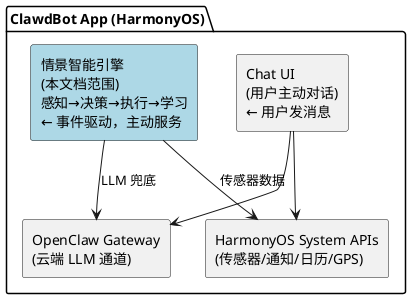
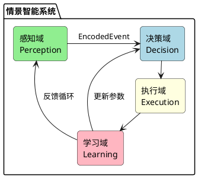
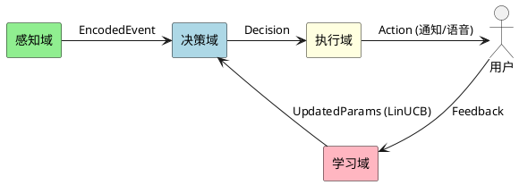
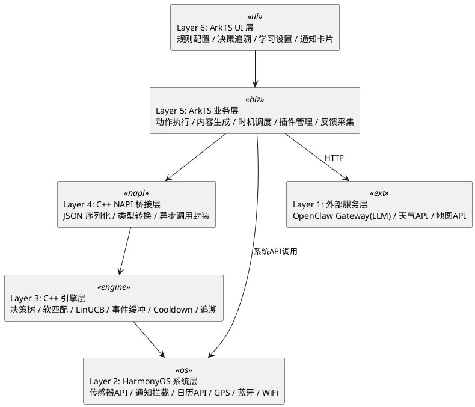
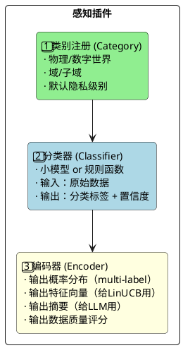
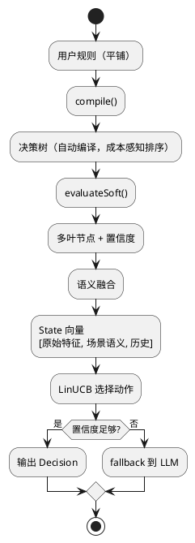
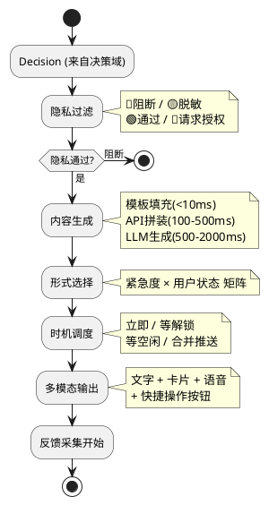
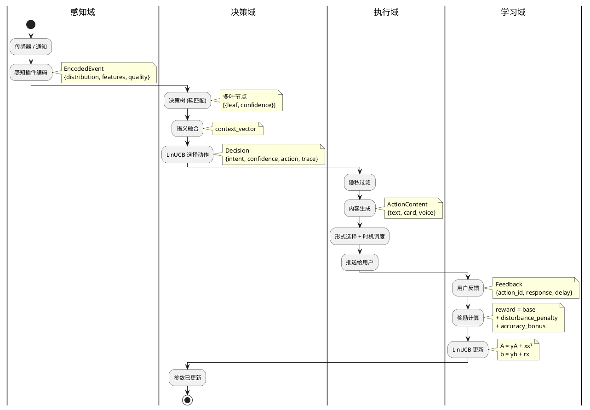

# 情景智能框架设计文档
> 版本: 3.0
> 日期: 2026-02-19
> 作者: 洪杰 & Cecilia

### 修订记录

| 版本 | 日期 | 作者 | 变更说明 |
|------|------|------|---------|
| 1.0 | 2026-02-17 | 洪杰 & Linda | 初版：概述、数据分类、感知插件、意图识别、重要性计算、奖励系统、学习系统 |
| 2.0 | 2026-02-19 | 洪杰 & Cecilia | 编码器改为概率分布输出；意图识别重写：可配置规则→自动编译决策树→软匹配→LinUCB(语义融合)→鲁棒性5层防护；新增时序规则、OR条件、Cooldown、决策追溯、模板继承、动态阈值；复合奖励函数 |
| 3.0 | 2026-02-19 | 洪杰 & Cecilia | 按 DDD 七步法重构全文：Boundary→Use Case→Sub-domain→Layer→Architecture→Narrow-down→Entity；新增系统边界定义、四大问题域划分、六层架构模型、执行域设计、实施路线图 |

---

## 目录

- [1. Boundary — 问题边界](#1-boundary--问题边界)
  - [1.1 情景智能是什么](#11-情景智能是什么)
  - [1.2 情景智能不是什么](#12-情景智能不是什么)
  - [1.3 系统边界图](#13-系统边界图)
  - [1.4 输入边界](#14-输入边界)
  - [1.5 输出边界](#15-输出边界)
  - [1.6 隐私边界](#16-隐私边界)
- [2. Use Case — 场景与用例](#2-use-case--场景与用例)
  - [2.1 物理世界数据源](#21-物理世界数据源)
  - [2.2 数字世界数据源](#22-数字世界数据源按马斯洛需求层次)
  - [2.3 核心用例清单](#23-核心用例清单)
  - [2.4 用例优先级](#24-用例优先级)
- [3. Sub-domain — 问题域划分](#3-sub-domain--问题域划分)
  - [3.1 四大问题域](#31-四大问题域)
  - [3.2 感知域（Perception）](#32-感知域perception)
  - [3.3 决策域（Decision）](#33-决策域decision)
  - [3.4 执行域（Execution）](#34-执行域execution)
  - [3.5 学习域（Learning）](#35-学习域learning)
  - [3.6 域间交互](#36-域间交互)
- [4. Layer — 分层架构](#4-layer--分层架构)
  - [4.1 六层模型](#41-六层模型)
  - [4.2 各层职责与语言](#42-各层职责与语言)
  - [4.3 层间依赖规则](#43-层间依赖规则)
- [5. Architecture — 架构设计](#5-architecture--架构设计)
  - [5.1 感知域架构](#51-感知域架构)
  - [5.2 决策域架构](#52-决策域架构)
  - [5.3 执行域架构](#53-执行域架构)
  - [5.4 学习域架构](#54-学习域架构)
  - [5.5 数据流全景](#55-数据流全景)
- [6. Narrow-down — 技术要点](#6-narrow-down--技术要点)
  - [6.1 决策树自动编译](#61-决策树自动编译)
  - [6.2 软匹配策略](#62-软匹配策略)
  - [6.3 LinUCB 算法细节](#63-linucb-算法细节)
  - [6.4 鲁棒性详细设计](#64-鲁棒性详细设计)
  - [6.5 时序规则](#65-时序规则)
  - [6.6 Cooldown + 合并推送](#66-cooldown--合并推送)
  - [6.7 冷启动策略](#67-冷启动策略)
  - [6.8 端侧训练方案](#68-端侧训练方案)
- [7. Entity — 实现设计](#7-entity--实现设计)
  - [7.1 核心数据结构](#71-核心数据结构)
  - [7.2 C++ 模块设计](#72-c-模块设计)
  - [7.3 NAPI 接口定义](#73-napi-接口定义)
  - [7.4 ArkTS 服务设计](#74-arkts-服务设计)
  - [7.5 存储设计](#75-存储设计)
  - [7.6 目录结构](#76-目录结构)
  - [7.7 实施路线图](#77-实施路线图)

---

## 1. Boundary — 问题边界

### 1.1 情景智能是什么

在手机里放一个 **AI 秘书**，它能够：
- **感知** — 收集物理世界和数字世界的数据
- **理解** — 知道用户的需求和意图
- **行动** — 在合适的时机提供帮助

**核心原则：**

| 原则 | 说明 |
|------|------|
| **独立人格** | AI 是伙伴，不是附属品；有自己的观点和边界 |
| **隐私优先** | 用户控制 AI 能看到什么，默认最小权限 |
| **本地优先** | 个人数据不离开设备，学习在本地完成 |
| **渐进智能** | 从规则到模型到 LLM，按需升级复杂度 |

### 1.2 情景智能不是什么

| 不是 | 说明 |
|------|------|
| 不是通用 AI 助手 | 不处理用户主动发起的对话/问答（那是 ClawdBot 主体的事） |
| 不是通知管理器 | 不只是过滤/转发通知，而是理解场景后主动提供服务 |
| 不是后台服务 | 不是持续轮询所有数据，而是事件驱动 + 按需查询 |
| 不是云端系统 | 核心决策在本地完成，云端只用于 LLM 兜底和模型下发 |

### 1.3 系统边界图



**边界定义：**
- **与 Chat UI 的边界**：用户主动发消息 → Chat UI 处理；情景智能主动推送 → 通过通知/卡片/语音
- **与 OpenClaw Gateway 的边界**：情景智能只在 Layer 3（LLM 兜底）时调用 Gateway；日常决策纯本地
- **与 HarmonyOS 的边界**：情景智能通过系统 API 获取传感器数据、发送通知；不修改系统行为

### 1.4 输入边界

```
情景智能接收的输入：
├── 物理世界事件（传感器触发）
│   ├── 位置变化（GPS/WiFi/蓝牙）
│   ├── 运动状态变化（加速度计）
│   ├── 环境变化（光照/噪音/温度）
│   └── 手机状态变化（充电/电量/连接）
│
├── 数字世界事件（系统通知）
│   ├── 新消息通知（IM/邮件/短信）
│   ├── App 通知（外卖/快递/银行）
│   ├── 日历事件提醒
│   └── 系统事件（来电/闹钟）
│
└── 用户反馈（显式+隐式）
    ├── 点击/忽略/划走通知
    ├── 说"谢谢"/"别烦我"
    └── 主动配置规则
```

### 1.5 输出边界

```
情景智能产生的输出：
├── 用户通知（主要输出）
│   ├── 系统通知栏（全屏/横幅/小红点/静默）
│   ├── 语音播报（开车模式）
│   ├── 卡片（富媒体信息）
│   └── 合并摘要（批量信息汇总）
│
├── 静默动作（不打扰用户）
│   ├── 预缓存数据（提前加载天气/路况）
│   ├── 调整系统设置（静音/亮度）
│   └── 后台准备（整理日程摘要）
│
└── 反馈给学习系统
    ├── 决策追溯记录
    └── 奖励信号（给 LinUCB）
```

### 1.6 隐私边界

| 级别 | 符号 | AI 可见内容 | 说明 |
|------|------|-----------|------|
| **开放** | 🟢 | 完整原文 | AI 完全可见 |
| **摘要** | 🟡 | 摘要+元数据 | AI 只看概要，不看原文 |
| **禁止** | 🔴 | 仅"有新消息" | AI 完全不可见 |
| **授权** | 🔵 | 临时完整访问 | 用户授权后可见，用完撤销 |

**隐私原则：**
1. 默认最小权限（新数据源默认 🔴）
2. 用户主动授权
3. 临时授权自动撤销
4. 摘要级别只给统计，不给原文
5. 审计日志可查

---

## 2. Use Case — 场景与用例

### 2.1 物理世界数据源

#### 👤 人 (Human)

| 子类 | 数据 | 来源 |
|------|------|------|
| **生命体征** | 心率、HRV、血压、血氧、体温 | 手表/手环 |
| **运动状态** | 静止(坐/站/躺)、走路、跑步、骑车、坐车 | 加速度计 |
| **身体属性** | 身高、体重、体脂、年龄、性别 | 用户档案 |
| **精神状态** | 睡眠质量、疲劳度、压力、情绪 | 推断/自报 |
| **生物特征** | 声纹、面部、指纹 | 传感器 |

#### 📱 手机 (Phone)

| 子类 | 数据 |
|------|------|
| **姿态** | 握持方式、屏幕朝向 |
| **位置** | GPS坐标、地点类型(家/公司/商场) |
| **电源** | 电量、充电状态 |
| **连接** | WiFi、蓝牙、信号强度 |
| **时间** | 时刻、星期、节假日 |

#### 🌳 环境 (五感)

| 感官 | 数据 | 来源 |
|------|------|------|
| 👁️ **眼** | 光照、场景、人物、物体 | 摄像头/光线传感器 |
| 👂 **耳** | 噪音级别、环境音类型、语音 | 麦克风 |
| 👃 **鼻** | 空气质量、PM2.5 | 传感器/API |
| 👅 **舌** | (间接推断) | 场景+时间 |
| 🖐️ **身** | 温度、湿度、气压 | 环境传感器 |

### 2.2 数字世界数据源（按马斯洛需求层次）

| 层级 | 数据 | 隐私 | 来源 |
|------|------|------|------|
| **1️⃣ 生理** | 外卖/食品订单 | 🟢 | 美团/饿了么 |
| | 健康数据趋势 | 🟡 | 健康app |
| | 医疗诊断记录 | 🔴 | 医疗app |
| **2️⃣ 安全** | 快递/出行状态 | 🟢 | 快递/出行app |
| | 账单提醒 | 🟡 | 银行app |
| | 财务明细/密码 | 🔴 | 金融app |
| **3️⃣ 社交** | 公开群聊 | 🟢 | 社交app |
| | 私聊消息摘要 | 🟡 | IM app |
| | 私密对话内容 | 🔴 | IM app |
| **4️⃣ 尊重** | 任务/日程 | 🟢 | 日历/任务app |
| | 工作文档标题 | 🟡 | 办公app |
| | 薪资/绩效 | 🔴 | HR系统 |
| **5️⃣ 自我实现** | 公开学习内容 | 🟢 | 学习平台 |
| | 学习进度 | 🟡 | 学习app |
| | 私人日记 | 🔴 | 笔记app |

### 2.3 核心用例清单

| 用例 | 触发条件 | 动作 | 优先级 |
|------|---------|------|--------|
| 🚗 通勤提醒 | 工作日 + 7:00±30min + 在家 | 推路况+天气 | 🟡 |
| 🍜 午餐推荐 | 工作日 + 12:00±1h + 在公司 | 推附近餐厅/外卖 | 🟢 |
| 📱 重要消息 | 老婆/老板发消息 | 紧急通知 | 🔴 |
| 🔋 低电量 | 电量<20% + 未充电 | 提醒充电 | 🟡 |
| 🌙 睡前摘要 | 22:00-24:00 + 在家 | 明日日程+天气 | 🟢 |
| 📦 快递到达 | 快递通知 + 在家 | 提醒取件 | 🟢 |
| 🏃 运动提醒 | 久坐>2小时 | 建议活动 | 🟢 |
| 📧 消息堆积 | 10min内3+条未读 | 合并提醒 | 🟡 |
| 🚗 回家路况 | 离开公司+上车 | 播报路况 | 🟡 |
| 😴 睡眠建议 | 连续3天23点后还在用手机 | 建议早睡 | 🟢 |
| 📅 会议准备 | 日历事件前15min | 提醒+材料 | 🟡 |
| 🔇 自动静音 | 进入会议室/电影院 | 静音手机 | ⚪ |

### 2.4 用例优先级

| 阶段 | 用例 | 原因 |
|------|------|------|
| **MVP** | 通勤提醒、重要消息、低电量、睡前摘要 | 触发条件简单，价值高 |
| **Phase 2** | 午餐推荐、消息堆积、会议准备、快递到达 | 需要通知拦截 |
| **Phase 3** | 运动提醒、睡眠建议、自动静音、回家路况 | 需要持续传感器+时序 |

---

## 3. Sub-domain — 问题域划分

### 3.1 四大问题域



### 3.2 感知域（Perception）

**职责：** 收集原始数据，编码为结构化的概率分布事件

```
输入：传感器原始数据 / 系统通知 / API 数据
输出：EncodedEvent（概率分布 + 特征向量 + 数据质量）

子模块：
├── 插件注册（类别/分类器/编码器三要素）
├── 物理世界编码器（位置/运动/环境 → 概率分布）
├── 数字世界编码器（通知/日历/消息 → 概率分布）
└── 感知总线（事件路由 + 隐私预过滤）
```

**核心接口：** 概率分布输出（multi-label，不要求归一化）+ 数据质量评分

### 3.3 决策域（Decision）

**职责：** 根据当前场景，决定做什么

```
输入：EncodedEvent + 用户上下文
输出：Decision（意图 + 置信度 + 动作类型 + 决策追溯）

子模块：
├── 规则配置（用户平铺编写规则）
├── 决策树编译器（自动编译 + 成本感知排序）
├── 软匹配引擎（概率分布 → 多叶节点置信度）
├── LinUCB 策略（语义融合 + 动作选择）
├── LLM 兜底（决策树未覆盖的场景）
├── Cooldown 管理
├── 时序规则引擎（事件序列匹配）
└── 决策追溯记录
```

**核心算法：** 决策树（软匹配）+ LinUCB（语义融合 + 时间衰减）

### 3.4 执行域（Execution）

**职责：** 将决策转化为具体的用户可见动作

```
输入：Decision
输出：用户通知 / 语音播报 / 静默动作

子模块：
├── 隐私过滤（执行前最后一道关）
├── 内容生成（模板填充 / API拼装 / LLM生成）
├── 形式选择（全屏/横幅/小红点/语音/静默）
├── 时机调度（立即/等解锁/等空闲/合并）
├── 多模态输出（文字/卡片/语音/快捷操作）
└── 反馈采集触发
```

**核心策略：** 紧急度 × 用户状态 → 推送形式矩阵

### 3.5 学习域（Learning）

**职责：** 从用户反馈中持续改进决策质量

```
输入：用户反馈（显式+隐式）
输出：更新后的 LinUCB 参数

子模块：
├── 反馈采集（点击/忽略/划走/谢谢/别烦我）
├── 奖励计算（基础反馈 + 打扰惩罚 + 正确性）
├── 异常检测（过滤坏反馈）
├── LinUCB 在线更新（时间衰减）
├── 检查点管理（自动快照 + 回滚）
└── 性能监控（滑动窗口平均奖励）
```

**核心机制：** 5层鲁棒性防护 + 时间衰减遗忘

### 3.6 域间交互



**数据格式约定：**
- 感知→决策：`EncodedEvent`（概率分布 + 特征 + quality）
- 决策→执行：`Decision`（意图 + 置信度 + 动作 + 追溯）
- 执行→学习：`Feedback`（动作ID + 用户响应 + 延迟）
- 学习→决策：直接更新 LinUCB 内部参数（A, b 矩阵）

---

## 4. Layer — 分层架构

### 4.1 六层模型



### 4.2 各层职责与语言

| 层 | 职责 | 语言 | 原因 |
|----|------|------|------|
| UI 层 | 用户交互界面 | ArkTS | HarmonyOS UI 必须用 ArkTS |
| 业务层 | 执行域逻辑 | ArkTS | 需调系统 API、UI 渲染 |
| NAPI 桥接 | ArkTS ↔ C++ | C++ | N-API 标准 |
| 引擎层 | 决策域+学习域核心 | C++ | 性能、内存控制、跨平台 |
| 系统层 | 感知域数据源 | ArkTS→C++ | 系统 API 用 ArkTS，编码用 C++ |
| 外部服务 | LLM/API | HTTP | 网络调用 |

### 4.3 层间依赖规则

```
上层可以调用下层 ✅
下层不能调用上层 ❌（通过回调/事件通知）
同层之间通过接口通信 ✅
跨层调用禁止（必须经过相邻层）❌
```

---

## 5. Architecture — 架构设计

### 5.1 感知域架构

#### 插件注册三要素



#### 编码器输出规范

```typescript
interface EncodedOutput {
  distribution: Map<string, number>;  // 概率分布（不要求归一化）
  features: number[];                 // 特征向量
  summary?: string;                   // 文本摘要
  quality: number;                    // 数据质量 0~1
}
```

#### 各插件分布输出示例

| 插件 | 分布输出 | 说明 |
|------|---------|------|
| 位置 | `{home:0.8, market:0.7, office:0.02}` | GPS 精度差时多地点有概率 |
| 运动 | `{still:0.6, walking:0.3, driving:0.1}` | 等红灯时静止和开车都可能 |
| 时间段 | `{morning:0.9, commute:0.7}` | 非互斥分类 |
| 噪音 | `{quiet:0.4, office:0.5, cafe:0.3}` | 环境音不确定 |

### 5.2 决策域架构

#### 整体流程



#### 规则配置

用户平铺写规则，系统自动编译为决策树：

```typescript
interface SmartRule {
  id: string;
  name: string;
  enabled: boolean;
  conditions: Map<string, RuleCondition>;       // AND 关系
  conditionGroups?: Map<string, RuleCondition>[]; // OR 组（可选）
  temporal?: TemporalCondition;                 // 时序条件（可选）
  extends?: string[];                           // 模板继承（可选）
  intent: string;
  priority: '🔴' | '🟡' | '🟢' | '⚪';
  action: string;
  cooldown?: CooldownConfig;
}
```

#### 决策树自动编译

- 按 key 自动建树，相同 key 合并
- 成本感知排序：便宜的判断（时间、星期）放上层，贵的（GPS、传感器）放下层
- 规则变更时自动重新编译

#### 软匹配

- 每个条件返回 0~1 置信度（不是 boolean）
- 缺失数据 = 0.5（不知道 ≠ 不匹配）
- 位置等关键特征多源融合（GPS + WiFi + 蓝牙 + 历史）
- 决策树可走多条路径，置信度沿路径相乘
- 最终按置信度分级响应

#### LinUCB（语义融合）

一个全局 LinUCB，输入语义融合后的状态向量：

```
State = concat(
  raw_features,     // 原始感知特征 ~20维
  context_vector,   // 叶节点语义加权融合 ~10维
  history_features, // 推送次数/最近反馈 ~10维
) → 总计 ~40维

score(action) = θᵀx + α√(xᵀA⁻¹x)
更新：A = γA + xxᵀ, b = γb + rx （γ=0.998 时间衰减）
```

### 5.3 执行域架构

#### 执行流水线



#### 推送形式矩阵

```
            空闲        忙碌        开会        睡觉        开车
🔴 立即    全屏+声音   横幅+震动   横幅+震动   全屏+声音   语音播报
🟡 尽快    横幅        小红点      静默        静默        语音
🟢 稍后    小红点      静默        静默        静默        静默
⚪ 背景    静默        静默        静默        静默        静默
```

低置信度（<0.6）自动降一级（全屏→横幅→小红点→静默）。

#### 合并推送

5分钟内多条 🟢/⚪ 推送合并为一条摘要通知。

### 5.4 学习域架构

#### 奖励计算

```python
reward = base_reward              # 显式/隐式反馈
       + disturbance_penalty      # -0.1 × (最近推送次数^1.5)
       + accuracy_bonus           # 推对了+0.5 / 该推没推-1.0
```

时段加权：睡觉×3、开会×2、开车×2.5。

#### 5层鲁棒性防护

| 层 | 防护 | 机制 |
|----|------|------|
| 输入 | 特征异常 | 范围检查 + 缺失值填充 |
| 反馈 | 异常反馈 | 3σ检测 + 频率限制 + 奖励裁剪 |
| 模型 | 参数保护 | 时间衰减γ + 变化限制5% + 条件数监控 |
| 输出 | 不确定性 | 置信度检查 + 不确定时回退规则 |
| 系统 | 整体退化 | 每日检查点 + 性能监控 + 自动回滚 |

#### 冷启动

| 阶段 | 规则 | RL | 说明 |
|------|------|-----|------|
| 前2周 | 100% | 0% | 只收集数据 |
| 第2周 | 70% | 30% | 开始参与 |
| 第4周+ | 30% | 70% | 逐步放权 |
| 稳定后 | 兜底 | 主导 | RL 不确定时用规则 |

### 5.5 数据流全景



---

## 6. Narrow-down — 技术要点

### 6.1 决策树自动编译

**Key 选择策略：** `score = coverage × discrimination / cost`

```typescript
const featureCosts: Record<string, number> = {
  'weekday': 1, 'hour': 1, 'charging': 1, 'battery': 1,  // 免费
  'keyword': 2, 'sender': 2, 'app': 2,                    // 轻量
  'location': 10, 'activity': 10,                         // 需要传感器
  'noise': 15, 'heartrate': 20,                           // 昂贵
};
```

便宜的 key 放上层 → 提前剪枝 → 避免不必要的传感器查询。

### 6.2 软匹配策略

**时间：** 高斯衰减，容差内1.0，超出指数衰减
```
target=7:30, tolerance=30min:
7:30→1.0, 7:00→1.0, 6:50→0.85, 6:30→0.45, 6:00→0.05
```

**位置：** 多源融合取最高
```
GPS(如果有) + WiFi SSID(0.95) + 蓝牙设备(0.8) + 历史推断
→ max(scores)
```

**缺失数据：** confidence=0.5（中性），不是0（否定）

### 6.3 LinUCB 算法细节

```
选动作：score = θᵀx + α√(xᵀA⁻¹x)
更新：  A = γA + xxᵀ, b = γb + rx
参数：  d≈40, α=1.0, γ=0.998
内存：  A(40×40) × 10动作 × 4字节 ≈ 70KB
更新耗时：<0.01ms
```

**语义融合：** 叶节点→语义向量（从规则条件自动生成）→ 按置信度加权融合 → 一个全局 LinUCB

**探索策略：** 🔴紧急不探索；低风险+用户闲着 ε=0.2；其他 ε=0.05

### 6.4 鲁棒性详细设计

**时间衰减：** γ=0.998，半衰期≈346次（约2周），旧习惯自动淡出

**异常检测：** 奖励偏离3σ / 1分钟内>5条反馈 / 特征超出范围 → 过滤

**回滚：** 每日快照，性能下降30% → 自动恢复检查点

### 6.5 时序规则

```typescript
interface TemporalCondition {
  event: string;                              // 事件类型
  window: number;                             // 时间窗口(ms)
  count?: { min?: number, max?: number };
  sequence?: string[];                        // 有序事件序列
}
```

实现：事件环形缓冲区（最近7天，最多10000条），O(N) 扫描。

### 6.6 Cooldown + 合并推送

```typescript
interface CooldownConfig {
  duration: number;       // 最小间隔(ms)
  scope: 'rule' | 'intent';  // 去重范围
  resetOn?: string;       // 重置事件
  merge?: boolean;        // 冷却期间合并
}
```

### 6.7 冷启动策略

MVP 先用统计学习（每个叶节点的动作平均奖励表），再升级到 LinUCB。

### 6.8 端侧训练方案

| 阶段 | 方案 | 说明 |
|------|------|------|
| MVP | 统计学习（无需梯度） | 平均奖励表，argmax |
| Phase 2 | C++ 手写 LinUCB | 矩阵运算，<100行代码 |
| Phase 3 | MindSpore Lite（如果支持训练） | 华为原生 |

---

## 7. Entity — 实现设计

### 7.1 核心数据结构

```typescript
// 规则
interface SmartRule {
  id: string;
  name: string;
  enabled: boolean;
  conditions: Map<string, RuleCondition>;
  conditionGroups?: Map<string, RuleCondition>[];
  temporal?: TemporalCondition;
  extends?: string[];
  intent: string;
  priority: string;
  action: string;
  cooldown?: CooldownConfig;
}

// 决策树节点
interface ExecNode {
  key: string;
  branches: Map<Object, ExecNode | LeafNode>;
  fallthrough?: ExecNode;
}

// 叶节点
interface LeafNode {
  rules: SmartRule[];
  semantic: number[];  // 语义向量
}

// 匹配结果
interface MatchResult {
  rule: SmartRule;
  confidence: number;
  path: { key: string, actual: Object, expected: Object, confidence: number }[];
}

// 决策输出
interface Decision {
  intent: string;
  confidence: number;
  priority: string;
  action: string;
  actionParams: Record<string, string>;
  trace: DecisionTrace;
}

// 编码器输出
interface EncodedOutput {
  distribution: Map<string, number>;
  features: number[];
  quality: number;
  summary?: string;
}
```

### 7.2 C++ 模块设计

```cpp
// 规则编译器
class RuleCompiler {
  ExecNode* compile(vector<Rule>& rules);
  string selectBestKey(vector<Rule>& rules);
  SemanticVector generateSemantic(Rule& rule);
};

// 决策树执行
class DecisionTree {
  vector<MatchResult> evaluateSoft(ExecNode* root, Context& ctx);
};

// 软匹配器
class SoftMatcher {
  float match(string key, Value actual, Value expected);
  float matchLocation(string target, LocationSources& sources);
  float matchHour(float actual, float target, float tolerance);
};

// LinUCB 策略
class RobustLinUCB {
  int selectAction(VectorXf& x);
  void update(int arm, VectorXf& x, float reward);
  // 内置：时间衰减、异常过滤、奖励裁剪
};

// 事件缓冲区
class EventRingBuffer {
  void push(Event& e);
  int countInWindow(string event, int64_t windowMs);
  bool matchSequence(vector<string>& seq, int64_t windowMs);
};

// Cooldown 管理
class CooldownManager {
  bool isInCooldown(string ruleId);
  void startCooldown(string ruleId, int64_t durationMs);
  void mergeEvent(string ruleId, Event& e);
};

// 决策追溯
class DecisionTracer {
  void record(vector<MatchResult>& results, Context& ctx);
  string getHistory(int limit);  // JSON
};

// 模型检查点
class ModelCheckpoint {
  void save(RobustLinUCB& model);
  void maybeRollback(RobustLinUCB& model, float currentAvgReward);
};
```

### 7.3 NAPI 接口定义

```typescript
// ArkTS 侧调用 C++ 引擎
import ruleEngine from 'libruleengine.so';

// 规则管理
ruleEngine.loadRules(rulesJson: string): boolean;
ruleEngine.compileTree(): boolean;

// 事件输入
ruleEngine.pushEvent(eventJson: string): void;

// 决策
ruleEngine.evaluate(contextJson: string): string;  // → Decision JSON

// 反馈
ruleEngine.feedback(ruleId: string, reward: number): void;

// 追溯
ruleEngine.getTraceHistory(limit: number): string;  // → JSON

// 模型管理
ruleEngine.saveModel(path: string): boolean;
ruleEngine.loadModel(path: string): boolean;
ruleEngine.resetModel(): boolean;
```

### 7.4 ArkTS 服务设计

```typescript
// 情景智能主服务
class ContextAIService {
  // 初始化引擎
  async init(): Promise<void>;
  
  // 事件循环：接收感知事件 → 决策 → 执行
  async onEvent(event: EncodedEvent): Promise<void>;
  
  // 执行流水线
  async executeAction(decision: Decision): Promise<void>;
}

// 感知插件管理
class PluginManager {
  registerPlugin(plugin: PerceptionPlugin): void;
  startAll(): void;
  stopAll(): void;
}

// 内容生成器
class ContentGenerator {
  async generate(intent: string, context: Context): Promise<ActionContent>;
}

// 反馈采集器
class FeedbackCollector {
  watch(actionId: string): void;
  onUserResponse(actionId: string, response: UserResponse): void;
}
```

### 7.5 存储设计

```
entry/src/main/resources/
└── rawfile/
    └── context_ai/
        └── default_rules.json     # 预设规则库

AppData/
└── context_ai/
    ├── rules/
    │   ├── user_rules.json        # 用户自定义规则
    │   └── templates.json         # 规则模板
    ├── model/
    │   ├── linucb_params.bin      # LinUCB 参数 (~70KB)
    │   ├── action_stats.json      # 统计学习数据（MVP）
    │   └── checkpoints/           # 历史检查点
    ├── data/
    │   ├── event_buffer.bin       # 事件环形缓冲区
    │   ├── feedback_log.db        # 反馈日志
    │   └── decision_trace.db      # 决策追溯（最近1000条）
    └── config/
        └── learning_config.json   # 学习参数（γ, α等）
```

总存储：< 5MB

### 7.6 目录结构

```
entry/src/main/
├── ets/
│   └── service/
│       └── contextai/
│           ├── ContextAIService.ets    # 主服务
│           ├── PluginManager.ets       # 插件管理
│           ├── ContentGenerator.ets    # 内容生成
│           ├── DeliveryManager.ets     # 推送形式+时机
│           ├── FeedbackCollector.ets   # 反馈采集
│           └── plugins/                # 感知插件
│               ├── LocationPlugin.ets
│               ├── TimePlugin.ets
│               ├── NotificationPlugin.ets
│               └── MotionPlugin.ets
├── cpp/
│   └── rule_engine/
│       ├── CMakeLists.txt
│       ├── napi_entry.cpp              # NAPI 绑定
│       ├── rule_compiler.h/cpp         # 规则编译器
│       ├── decision_tree.h/cpp         # 决策树
│       ├── soft_matcher.h/cpp          # 软匹配
│       ├── linucb.h/cpp                # LinUCB
│       ├── event_buffer.h/cpp          # 事件缓冲
│       ├── cooldown.h/cpp              # 冷却管理
│       ├── decision_tracer.h/cpp       # 决策追溯
│       ├── feedback_validator.h/cpp    # 异常检测
│       ├── model_checkpoint.h/cpp      # 检查点
│       └── json_utils.h/cpp            # JSON 工具
└── resources/rawfile/context_ai/
    └── default_rules.json
```

### 7.7 实施路线图

| 阶段 | 周期 | 目标 | 交付物 |
|------|------|------|--------|
| **MVP** | 4周 | 基础规则引擎 + 4个核心用例 | 硬匹配决策树 + 模板通知 + 统计学习 |
| **Phase 2** | 4周 | 软匹配 + LinUCB + 通知拦截 | 概率分布编码 + LinUCB + 8个用例 |
| **Phase 3** | 4周 | 时序规则 + 语音 + 鲁棒性 | 事件缓冲 + TTS + 5层防护 + 12个用例 |
| **Phase 4** | 持续 | LLM 兜底 + 联邦学习 + 更多插件 | 完整系统 |

**MVP 详细：**
1. Week 1: C++ 决策树（硬匹配）+ NAPI 接口
2. Week 2: 4个感知插件（时间/位置/电量/通知）
3. Week 3: ArkTS 执行层（通知推送 + 模板内容）
4. Week 4: 统计学习 + 反馈采集 + 基础UI

---

---

*文档完*
