# 情景智能框架设计文档
> 版本: 5.0
> 日期: 2026-02-22
> 作者: 刘洪杰

### 修订记录

| 版本 | 日期 | 作者 | 变更说明 |
|------|------|------|---------|
| 1.0 | 2026-02-17 | 刘洪杰 | 初版：概述、数据分类、感知插件、意图识别、重要性计算、奖励系统、学习系统 |
| 2.0 | 2026-02-19 | 刘洪杰 | 编码器改为概率分布输出；意图识别重写：可配置规则→自动编译决策树→软匹配→LinUCB(语义融合)→鲁棒性5层防护；新增时序规则、OR条件、Cooldown、决策追溯、模板继承、动态阈值；复合奖励函数 |
| 3.0 | 2026-02-19 | 刘洪杰 | 按 DDD 七步法重构全文：Boundary→Use Case→Sub-domain→Layer→Architecture→Narrow-down→Entity；新增系统边界定义、四大问题域划分、六层架构模型、执行域设计、实施路线图 |
| 4.0 | 2026-02-20 | 刘洪杰 | C++ NAPI 迁移实施（4 新模块）；context.test 远程测试能力；21 场景全覆盖测试套件；cooldown loadRules 修复；实际目录结构更新 |
| 5.0 | 2026-02-22 | 刘洪杰 | LLM 兜底规则反馈闭环（pending→promote/remove）；规则去重机制；推荐防重复；积极探索模式设计；FeedbackService 卡片生命周期；合并 context_awareness_design.md（采集策略、围栏学习、App学习、静默增强、穿戴集成、数据托盘、训练同步、反馈学习） |

---

## 目录

- [1. Boundary — 问题边界](#1-boundary--问题边界)
  - [1.1 情景智能是什么](#11-情景智能是什么)
  - [1.2 情景智能不是什么](#12-情景智能不是什么)
  - [1.3 系统边界图](#13-系统边界图)
  - [1.4 输入边界](#14-输入边界)
  - [1.5 输出边界](#15-输出边界)
  - [1.6 隐私边界](#16-隐私边界)
- [2. Use Case — 场景与用例](#2-use-case--场景与用例)
  - [2.1 物理世界数据源](#21-物理世界数据源)
  - [2.2 数字世界数据源](#22-数字世界数据源按马斯洛需求层次)
  - [2.3 核心用例清单](#23-核心用例清单)
  - [2.4 用例优先级](#24-用例优先级)
- [3. Sub-domain — 问题域划分](#3-sub-domain--问题域划分)
  - [3.1 四大问题域](#31-四大问题域)
  - [3.2 感知域（Perception）](#32-感知域perception)
  - [3.3 决策域（Decision）](#33-决策域decision)
  - [3.4 执行域（Execution）](#34-执行域execution)
  - [3.5 学习域（Learning）](#35-学习域learning)
  - [3.6 域间交互](#36-域间交互)
- [4. Layer — 分层架构](#4-layer--分层架构)
  - [4.1 六层模型](#41-六层模型)
  - [4.2 各层职责与语言](#42-各层职责与语言)
  - [4.3 层间依赖规则](#43-层间依赖规则)
- [5. Architecture — 架构设计](#5-architecture--架构设计)
  - [5.1 感知域架构](#51-感知域架构)
  - [5.2 决策域架构](#52-决策域架构)
  - [5.3 执行域架构](#53-执行域架构)
  - [5.4 学习域架构](#54-学习域架构)
  - [5.5 数据流全景](#55-数据流全景)
- [6. Narrow-down — 技术要点](#6-narrow-down--技术要点)
  - [6.1 决策树自动编译](#61-决策树自动编译)
  - [6.2 软匹配策略](#62-软匹配策略)
  - [6.3 LinUCB 算法细节](#63-linucb-算法细节)
  - [6.4 鲁棒性详细设计](#64-鲁棒性详细设计)
  - [6.5 时序规则](#65-时序规则)
  - [6.6 Cooldown + 合并推送](#66-cooldown--合并推送)
  - [6.7 冷启动策略](#67-冷启动策略)
  - [6.8 端侧训练方案](#68-端侧训练方案)
- [7. Entity — 实现设计](#7-entity--实现设计)
  - [7.1 核心数据结构](#71-核心数据结构)
  - [7.2 C++ 模块设计](#72-c-模块设计)
  - [7.3 NAPI 接口定义](#73-napi-接口定义)
  - [7.4 ArkTS 服务设计](#74-arkts-服务设计)
  - [7.5 存储设计](#75-存储设计)
  - [7.6 目录结构](#76-目录结构)
  - [7.7 实施路线图](#77-实施路线图)
- [8. 实施记录 — C++ NAPI 迁移](#8-实施记录--c-napi-迁移)
  - [8.1 迁移原则](#81-迁移原则)
  - [8.2 新增 C++ 模块](#82-新增-c-模块)
  - [8.3 ArkTS 包装层](#83-arkts-包装层)
  - [8.4 已修复问题](#84-已修复问题)
  - [8.5 实际目录结构](#85-实际目录结构)
- [9. 测试套件](#9-测试套件)
  - [9.1 测试架构](#91-测试架构)
  - [9.2 测试场景清单](#92-测试场景清单)
  - [9.3 测试结果](#93-测试结果)
- [10. LLM 兜底规则反馈闭环](#10-llm-兜底规则反馈闭环)
  - [10.1 设计目标](#101-设计目标)
  - [10.2 规则生命周期](#102-规则生命周期)
  - [10.3 Pending Rule 存储](#103-pending-rule-存储)
  - [10.4 反馈驱动的升降级](#104-反馈驱动的升降级)
  - [10.5 推荐防重复](#105-推荐防重复)
- [11. 规则去重机制](#11-规则去重机制)
  - [11.1 去重策略](#111-去重策略)
  - [11.2 去重时机](#112-去重时机)
- [12. 积极探索模式](#12-积极探索模式)
  - [12.1 设计理念](#121-设计理念)
  - [12.2 工作流程](#122-工作流程)
  - [12.3 状态指纹](#123-状态指纹)
  - [12.4 与普通模式的区别](#124-与普通模式的区别)
- [13. 多级采集策略（功耗优化）](#13-多级采集策略功耗优化)
  - [13.1 CellID 位置变化检测](#131-cellid-位置变化检测)
  - [13.2 采集间隔配置](#132-采集间隔配置)
  - [13.3 运动状态检测](#133-运动状态检测)
  - [13.4 拿起手机检测](#134-拿起手机检测)
- [14. 围栏特征学习](#14-围栏特征学习)
  - [14.1 数据结构](#141-数据结构)
  - [14.2 学习触发与特征匹配](#142-学习触发与特征匹配)
- [15. App 使用记录学习](#15-app-使用记录学习)
- [16. 静默模式增强](#16-静默模式增强)
  - [16.1 关键信息提取](#161-关键信息提取)
  - [16.2 情绪/心情检测](#162-情绪心情检测)
- [17. 穿戴设备集成](#17-穿戴设备集成)
- [18. 数据托盘规范](#18-数据托盘规范)
- [19. 训练数据同步系统（C++）](#19-训练数据同步系统c)
  - [19.1 架构概览](#191-架构概览)
  - [19.2 C++ 数据结构](#192-c-数据结构)
  - [19.3 NAPI 接口](#193-napi-接口)
  - [19.4 数据流程](#194-数据流程)
  - [19.5 服务端接口](#195-服务端接口)
- [20. 反馈学习系统详细设计](#20-反馈学习系统详细设计)
- [附录: 待办事项](#附录-待办事项)

---

## 1. Boundary — 问题边界

### 1.1 情景智能是什么

在手机里放一个 **AI 秘书**，它能够：
- **感知** — 收集物理世界和数字世界的数据
- **理解** — 知道用户的需求和意图
- **行动** — 在合适的时机提供帮助

**核心原则：**

| 原则 | 说明 |
|------|------|
| **独立人格** | AI 是伙伴，不是附属品；有自己的观点和边界 |
| **隐私优先** | 用户控制 AI 能看到什么，默认最小权限 |
| **本地优先** | 个人数据不离开设备，学习在本地完成 |
| **渐进智能** | 从规则到模型到 LLM，按需升级复杂度 |

### 1.2 情景智能不是什么

| 不是 | 说明 |
|------|------|
| 不是通用 AI 助手 | 不处理用户主动发起的对话/问答（那是 ClawdBot 主体的事） |
| 不是通知管理器 | 不只是过滤/转发通知，而是理解场景后主动提供服务 |
| 不是后台服务 | 不是持续轮询所有数据，而是事件驱动 + 按需查询 |
| 不是云端系统 | 核心决策在本地完成，云端只用于 LLM 兜底和模型下发 |

### 1.3 系统边界图

```plantuml
@startuml
package "ClawdBot App (HarmonyOS)" {
  rectangle "Chat UI\n(用户主动对话)\n← 用户发消息" as ChatUI
  rectangle "情景智能引擎\n(本文档范围)\n感知→决策→执行→学习\n← 事件驱动，主动服务" as ContextAI #LightBlue
  rectangle "OpenClaw Gateway\n(云端 LLM 通道)" as Gateway
  rectangle "HarmonyOS System APIs\n(传感器/通知/日历/GPS)" as SystemAPI
  
  ChatUI --> Gateway
  ContextAI --> Gateway : LLM 兜底
  ContextAI --> SystemAPI : 传感器数据
  ChatUI --> SystemAPI
}
@enduml
```



**边界定义：**
- **与 Chat UI 的边界**：用户主动发消息 → Chat UI 处理；情景智能主动推送 → 通过通知/卡片/语音
- **与 OpenClaw Gateway 的边界**：情景智能只在 Layer 3（LLM 兜底）时调用 Gateway；日常决策纯本地
- **与 HarmonyOS 的边界**：情景智能通过系统 API 获取传感器数据、发送通知；不修改系统行为

### 1.4 输入边界

```
情景智能接收的输入：
├── 物理世界事件（传感器触发）
│   ├── 位置变化（GPS/WiFi/蓝牙）
│   ├── 运动状态变化（加速度计）
│   ├── 环境变化（光照/噪音/温度）
│   └── 手机状态变化（充电/电量/连接）
│
├── 数字世界事件（系统通知）
│   ├── 新消息通知（IM/邮件/短信）
│   ├── App 通知（外卖/快递/银行）
│   ├── 日历事件提醒
│   └── 系统事件（来电/闹钟）
│
└── 用户反馈（显式+隐式）
    ├── 点击/忽略/划走通知
    ├── 说"谢谢"/"别烦我"
    └── 主动配置规则
```

### 1.5 输出边界

```
情景智能产生的输出：
├── 用户通知（主要输出）
│   ├── 系统通知栏（全屏/横幅/小红点/静默）
│   ├── 语音播报（开车模式）
│   ├── 卡片（富媒体信息）
│   └── 合并摘要（批量信息汇总）
│
├── 静默动作（不打扰用户）
│   ├── 预缓存数据（提前加载天气/路况）
│   ├── 调整系统设置（静音/亮度）
│   └── 后台准备（整理日程摘要）
│
└── 反馈给学习系统
    ├── 决策追溯记录
    └── 奖励信号（给 LinUCB）
```

### 1.6 隐私边界

| 级别 | 符号 | AI 可见内容 | 说明 |
|------|------|-----------|------|
| **开放** | 🟢 | 完整原文 | AI 完全可见 |
| **摘要** | 🟡 | 摘要+元数据 | AI 只看概要，不看原文 |
| **禁止** | 🔴 | 仅"有新消息" | AI 完全不可见 |
| **授权** | 🔵 | 临时完整访问 | 用户授权后可见，用完撤销 |

**隐私原则：**
1. 默认最小权限（新数据源默认 🔴）
2. 用户主动授权
3. 临时授权自动撤销
4. 摘要级别只给统计，不给原文
5. 审计日志可查

---

## 2. Use Case — 场景与用例

### 2.1 物理世界数据源

#### 👤 人 (Human)

| 子类 | 数据 | 来源 |
|------|------|------|
| **生命体征** | 心率、HRV、血压、血氧、体温 | 手表/手环 |
| **运动状态** | 静止(坐/站/躺)、走路、跑步、骑车、坐车 | 加速度计 |
| **身体属性** | 身高、体重、体脂、年龄、性别 | 用户档案 |
| **精神状态** | 睡眠质量、疲劳度、压力、情绪 | 推断/自报 |
| **生物特征** | 声纹、面部、指纹 | 传感器 |

#### 📱 手机 (Phone)

| 子类 | 数据 |
|------|------|
| **姿态** | 握持方式、屏幕朝向 |
| **位置** | GPS坐标、地点类型(家/公司/商场) |
| **电源** | 电量、充电状态 |
| **连接** | WiFi、蓝牙、信号强度 |
| **时间** | 时刻、星期、节假日 |

#### 🌳 环境 (五感)

| 感官 | 数据 | 来源 |
|------|------|------|
| 👁️ **眼** | 光照、场景、人物、物体 | 摄像头/光线传感器 |
| 👂 **耳** | 噪音级别、环境音类型、语音 | 麦克风 |
| 👃 **鼻** | 空气质量、PM2.5 | 传感器/API |
| 👅 **舌** | (间接推断) | 场景+时间 |
| 🖐️ **身** | 温度、湿度、气压 | 环境传感器 |

### 2.2 数字世界数据源（按马斯洛需求层次）

| 层级 | 数据 | 隐私 | 来源 |
|------|------|------|------|
| **1️⃣ 生理** | 外卖/食品订单 | 🟢 | 美团/饿了么 |
| | 健康数据趋势 | 🟡 | 健康app |
| | 医疗诊断记录 | 🔴 | 医疗app |
| **2️⃣ 安全** | 快递/出行状态 | 🟢 | 快递/出行app |
| | 账单提醒 | 🟡 | 银行app |
| | 财务明细/密码 | 🔴 | 金融app |
| **3️⃣ 社交** | 公开群聊 | 🟢 | 社交app |
| | 私聊消息摘要 | 🟡 | IM app |
| | 私密对话内容 | 🔴 | IM app |
| **4️⃣ 尊重** | 任务/日程 | 🟢 | 日历/任务app |
| | 工作文档标题 | 🟡 | 办公app |
| | 薪资/绩效 | 🔴 | HR系统 |
| **5️⃣ 自我实现** | 公开学习内容 | 🟢 | 学习平台 |
| | 学习进度 | 🟡 | 学习app |
| | 私人日记 | 🔴 | 笔记app |

### 2.3 核心用例清单

| 用例 | 触发条件 | 动作 | 优先级 |
|------|---------|------|--------|
| 🚗 通勤提醒 | 工作日 + 7:00±30min + 在家 | 推路况+天气 | 🟡 |
| 🍜 午餐推荐 | 工作日 + 12:00±1h + 在公司 | 推附近餐厅/外卖 | 🟢 |
| 📱 重要消息 | 老婆/老板发消息 | 紧急通知 | 🔴 |
| 🔋 低电量 | 电量<20% + 未充电 | 提醒充电 | 🟡 |
| 🌙 睡前摘要 | 22:00-24:00 + 在家 | 明日日程+天气 | 🟢 |
| 📦 快递到达 | 快递通知 + 在家 | 提醒取件 | 🟢 |
| 🏃 运动提醒 | 久坐>2小时 | 建议活动 | 🟢 |
| 📧 消息堆积 | 10min内3+条未读 | 合并提醒 | 🟡 |
| 🚗 回家路况 | 离开公司+上车 | 播报路况 | 🟡 |
| 😴 睡眠建议 | 连续3天23点后还在用手机 | 建议早睡 | 🟢 |
| 📅 会议准备 | 日历事件前15min | 提醒+材料 | 🟡 |
| 🔇 自动静音 | 进入会议室/电影院 | 静音手机 | ⚪ |

### 2.4 用例优先级

| 阶段 | 用例 | 原因 |
|------|------|------|
| **MVP** | 通勤提醒、重要消息、低电量、睡前摘要 | 触发条件简单，价值高 |
| **Phase 2** | 午餐推荐、消息堆积、会议准备、快递到达 | 需要通知拦截 |
| **Phase 3** | 运动提醒、睡眠建议、自动静音、回家路况 | 需要持续传感器+时序 |

---

## 3. Sub-domain — 问题域划分

### 3.1 四大问题域

```plantuml
@startuml
skinparam rectangle {
  RoundCorner 10
}

package "情景智能系统" {
  rectangle "感知域\nPerception" as P #LightGreen
  rectangle "决策域\nDecision" as D #LightBlue
  rectangle "执行域\nExecution" as E #LightYellow
  rectangle "学习域\nLearning" as L #LightPink
  
  P -right-> D : EncodedEvent
  D -right-> E : Decision
  E -right-> L : Feedback
  L -left-> P : 反馈循环
  L -up-> D : 更新参数
}
@enduml
```



### 3.2 感知域（Perception）

**职责：** 收集原始数据，编码为结构化的概率分布事件

```
输入：传感器原始数据 / 系统通知 / API 数据
输出：EncodedEvent（概率分布 + 特征向量 + 数据质量）

子模块：
├── 插件注册（类别/分类器/编码器三要素）
├── 物理世界编码器（位置/运动/环境 → 概率分布）
├── 数字世界编码器（通知/日历/消息 → 概率分布）
└── 感知总线（事件路由 + 隐私预过滤）
```

**核心接口：** 概率分布输出（multi-label，不要求归一化）+ 数据质量评分

### 3.3 决策域（Decision）

**职责：** 根据当前场景，决定做什么

```
输入：EncodedEvent + 用户上下文
输出：Decision（意图 + 置信度 + 动作类型 + 决策追溯）

子模块：
├── 规则配置（用户平铺编写规则）
├── 决策树编译器（自动编译 + 成本感知排序）
├── 软匹配引擎（概率分布 → 多叶节点置信度）
├── LinUCB 策略（语义融合 + 动作选择）
├── LLM 兜底（决策树未覆盖的场景）
├── Cooldown 管理
├── 时序规则引擎（事件序列匹配）
└── 决策追溯记录
```

**核心算法：** 决策树（软匹配）+ LinUCB（语义融合 + 时间衰减）

### 3.4 执行域（Execution）

**职责：** 将决策转化为具体的用户可见动作

```
输入：Decision
输出：用户通知 / 语音播报 / 静默动作

子模块：
├── 隐私过滤（执行前最后一道关）
├── 内容生成（模板填充 / API拼装 / LLM生成）
├── 形式选择（全屏/横幅/小红点/语音/静默）
├── 时机调度（立即/等解锁/等空闲/合并）
├── 多模态输出（文字/卡片/语音/快捷操作）
└── 反馈采集触发
```

**核心策略：** 紧急度 × 用户状态 → 推送形式矩阵

### 3.5 学习域（Learning）

**职责：** 从用户反馈中持续改进决策质量

```
输入：用户反馈（显式+隐式）
输出：更新后的 LinUCB 参数

子模块：
├── 反馈采集（点击/忽略/划走/谢谢/别烦我）
├── 奖励计算（基础反馈 + 打扰惩罚 + 正确性）
├── 异常检测（过滤坏反馈）
├── LinUCB 在线更新（时间衰减）
├── 检查点管理（自动快照 + 回滚）
└── 性能监控（滑动窗口平均奖励）
```

**核心机制：** 5层鲁棒性防护 + 时间衰减遗忘

### 3.6 域间交互

```plantuml
@startuml
rectangle "感知域" as P #LightGreen
rectangle "决策域" as D #LightBlue
rectangle "执行域" as E #LightYellow
rectangle "学习域" as L #LightPink
actor 用户 as U

P -right-> D : EncodedEvent
D -right-> E : Decision
E -right-> U : Action (通知/语音)
U -down-> L : Feedback
L -left-> D : UpdatedParams (LinUCB)
@enduml
```

**数据格式约定：**
- 感知→决策：`EncodedEvent`（概率分布 + 特征 + quality）
- 决策→执行：`Decision`（意图 + 置信度 + 动作 + 追溯）
- 执行→学习：`Feedback`（动作ID + 用户响应 + 延迟）
- 学习→决策：直接更新 LinUCB 内部参数（A, b 矩阵）

---

## 4. Layer — 分层架构

### 4.1 六层模型

```plantuml
@startuml
skinparam component {
  BackgroundColor<<ui>> #DCEEFB
  BackgroundColor<<biz>> #D5E8D4
  BackgroundColor<<napi>> #FFF2CC
  BackgroundColor<<engine>> #F8CECC
  BackgroundColor<<os>> #E1D5E7
  BackgroundColor<<ext>> #F5F5F5
}

rectangle "Layer 6: ArkTS UI 层\n规则配置 / 决策追溯 / 学习设置 / 通知卡片" <<ui>> as L6
rectangle "Layer 5: ArkTS 业务层\n动作执行 / 内容生成 / 时机调度 / 插件管理 / 反馈采集" <<biz>> as L5
rectangle "Layer 4: C++ NAPI 桥接层\nJSON 序列化 / 类型转换 / 异步调用封装" <<napi>> as L4
rectangle "Layer 3: C++ 引擎层\n决策树 / 软匹配 / LinUCB / 事件缓冲 / Cooldown / 追溯" <<engine>> as L3
rectangle "Layer 2: HarmonyOS 系统层\n传感器API / 通知拦截 / 日历API / GPS / 蓝牙 / WiFi" <<os>> as L2
rectangle "Layer 1: 外部服务层\nOpenClaw Gateway(LLM) / 天气API / 地图API" <<ext>> as L1

L6 -down-> L5
L5 -down-> L4
L4 -down-> L3
L3 -down-> L2
L5 -down-> L2 : 系统API调用
L5 -down-> L1 : HTTP
@enduml
```



### 4.2 各层职责与语言

| 层 | 职责 | 语言 | 原因 |
|----|------|------|------|
| UI 层 | 用户交互界面 | ArkTS | HarmonyOS UI 必须用 ArkTS |
| 业务层 | 执行域逻辑 | ArkTS | 需调系统 API、UI 渲染 |
| NAPI 桥接 | ArkTS ↔ C++ | C++ | N-API 标准 |
| 引擎层 | 决策域+学习域核心 | C++ | 性能、内存控制、跨平台 |
| 系统层 | 感知域数据源 | ArkTS→C++ | 系统 API 用 ArkTS，编码用 C++ |
| 外部服务 | LLM/API | HTTP | 网络调用 |

### 4.3 层间依赖规则

```
上层可以调用下层 ✅
下层不能调用上层 ❌（通过回调/事件通知）
同层之间通过接口通信 ✅
跨层调用禁止（必须经过相邻层）❌
```

---

## 5. Architecture — 架构设计

### 5.1 感知域架构

#### 插件注册三要素

```plantuml
@startuml
skinparam rectangle {
  RoundCorner 10
}

rectangle "感知插件" {
  rectangle "1️⃣ 类别注册 (Category)\n· 物理/数字世界\n· 域/子域\n· 默认隐私级别" as Cat #LightGreen
  rectangle "2️⃣ 分类器 (Classifier)\n· 小模型 or 规则函数\n· 输入：原始数据\n· 输出：分类标签 + 置信度" as Cls #LightBlue
  rectangle "3️⃣ 编码器 (Encoder)\n· 输出概率分布（multi-label）\n· 输出特征向量（给LinUCB用）\n· 输出摘要（给LLM用）\n· 输出数据质量评分" as Enc #LightYellow
  
  Cat -down-> Cls
  Cls -down-> Enc
}
@enduml
```



#### 编码器输出规范

```typescript
interface EncodedOutput {
  distribution: Map<string, number>;  // 概率分布（不要求归一化）
  features: number[];                 // 特征向量
  summary?: string;                   // 文本摘要
  quality: number;                    // 数据质量 0~1
}
```

#### 各插件分布输出示例

| 插件 | 分布输出 | 说明 |
|------|---------|------|
| 位置 | `{home:0.8, market:0.7, office:0.02}` | GPS 精度差时多地点有概率 |
| 运动 | `{still:0.6, walking:0.3, driving:0.1}` | 等红灯时静止和开车都可能 |
| 时间段 | `{morning:0.9, commute:0.7}` | 非互斥分类 |
| 噪音 | `{quiet:0.4, office:0.5, cafe:0.3}` | 环境音不确定 |

### 5.2 决策域架构

#### 整体流程

```plantuml
@startuml
start
:用户规则（平铺）;
:compile();
:决策树（自动编译，成本感知排序）;
:evaluateSoft();
:多叶节点 + 置信度;
:语义融合;
:State 向量\n[原始特征, 场景语义, 历史];
:LinUCB 选择动作;
if (置信度足够?) then (是)
  :输出 Decision;
else (否)
  :fallback 到 LLM;
endif
stop
@enduml
```



#### 规则配置

用户平铺写规则，系统自动编译为决策树：

```typescript
interface SmartRule {
  id: string;
  name: string;
  enabled: boolean;
  conditions: Map<string, RuleCondition>;       // AND 关系
  conditionGroups?: Map<string, RuleCondition>[]; // OR 组（可选）
  temporal?: TemporalCondition;                 // 时序条件（可选）
  extends?: string[];                           // 模板继承（可选）
  intent: string;
  priority: '🔴' | '🟡' | '🟢' | '⚪';
  action: string;
  cooldown?: CooldownConfig;
}
```

#### 决策树自动编译

- 按 key 自动建树，相同 key 合并
- 成本感知排序：便宜的判断（时间、星期）放上层，贵的（GPS、传感器）放下层
- 规则变更时自动重新编译

#### 软匹配

- 每个条件返回 0~1 置信度（不是 boolean）
- 缺失数据 = 0.5（不知道 ≠ 不匹配）
- 位置等关键特征多源融合（GPS + WiFi + 蓝牙 + 历史）
- 决策树可走多条路径，置信度沿路径相乘
- 最终按置信度分级响应

#### LinUCB（语义融合）

一个全局 LinUCB，输入语义融合后的状态向量：

```
State = concat(
  raw_features,     // 原始感知特征 ~20维
  context_vector,   // 叶节点语义加权融合 ~10维
  history_features, // 推送次数/最近反馈 ~10维
) → 总计 ~40维

score(action) = θᵀx + α√(xᵀA⁻¹x)
更新：A = γA + xxᵀ, b = γb + rx （γ=0.998 时间衰减）
```

### 5.3 执行域架构

#### 执行流水线

```plantuml
@startuml
start
:Decision (来自决策域);
:隐私过滤;
note right: 🔴阻断 / 🟡脱敏\n🟢通过 / 🔵请求授权
if (隐私通过?) then (是)
  :内容生成;
  note right: 模板填充(<10ms)\nAPI拼装(100-500ms)\nLLM生成(500-2000ms)
  :形式选择;
  note right: 紧急度 × 用户状态 矩阵
  :时机调度;
  note right: 立即 / 等解锁\n等空闲 / 合并推送
  :多模态输出;
  note right: 文字 + 卡片 + 语音\n+ 快捷操作按钮
  :反馈采集开始;
else (阻断)
  stop
endif
stop
@enduml
```



#### 推送形式矩阵

```
            空闲        忙碌        开会        睡觉        开车
🔴 立即    全屏+声音   横幅+震动   横幅+震动   全屏+声音   语音播报
🟡 尽快    横幅        小红点      静默        静默        语音
🟢 稍后    小红点      静默        静默        静默        静默
⚪ 背景    静默        静默        静默        静默        静默
```

低置信度（<0.6）自动降一级（全屏→横幅→小红点→静默）。

#### 合并推送

5分钟内多条 🟢/⚪ 推送合并为一条摘要通知。

### 5.4 学习域架构

#### 奖励计算

```python
reward = base_reward              # 显式/隐式反馈
       + disturbance_penalty      # -0.1 × (最近推送次数^1.5)
       + accuracy_bonus           # 推对了+0.5 / 该推没推-1.0
```

时段加权：睡觉×3、开会×2、开车×2.5。

#### 5层鲁棒性防护

| 层 | 防护 | 机制 |
|----|------|------|
| 输入 | 特征异常 | 范围检查 + 缺失值填充 |
| 反馈 | 异常反馈 | 3σ检测 + 频率限制 + 奖励裁剪 |
| 模型 | 参数保护 | 时间衰减γ + 变化限制5% + 条件数监控 |
| 输出 | 不确定性 | 置信度检查 + 不确定时回退规则 |
| 系统 | 整体退化 | 每日检查点 + 性能监控 + 自动回滚 |

#### 冷启动

| 阶段 | 规则 | RL | 说明 |
|------|------|-----|------|
| 前2周 | 100% | 0% | 只收集数据 |
| 第2周 | 70% | 30% | 开始参与 |
| 第4周+ | 30% | 70% | 逐步放权 |
| 稳定后 | 兜底 | 主导 | RL 不确定时用规则 |

### 5.5 数据流全景

```plantuml
@startuml
skinparam activity {
  BackgroundColor<<perception>> #D5E8D4
  BackgroundColor<<decision>> #DCEEFB
  BackgroundColor<<execution>> #FFF2CC
  BackgroundColor<<learning>> #F8CECC
}

|感知域|
start
:传感器 / 通知;
:感知插件编码;
note right: EncodedEvent\n{distribution, features, quality}

|决策域|
:决策树 (软匹配);
note right: 多叶节点\n[{leaf, confidence}]
:语义融合;
note right: context_vector
:LinUCB 选择动作;
note right: Decision\n{intent, confidence, action, trace}

|执行域|
:隐私过滤;
:内容生成;
note right: ActionContent\n{text, card, voice}
:形式选择 + 时机调度;
:推送给用户;

|学习域|
:用户反馈;
note right: Feedback\n{action_id, response, delay}
:奖励计算;
note right: reward = base\n+ disturbance_penalty\n+ accuracy_bonus
:LinUCB 更新;
note right: A = γA + xxᵀ\nb = γb + rx

|决策域|
:参数已更新;
stop
@enduml
```



---

## 6. Narrow-down — 技术要点

### 6.1 决策树自动编译

**Key 选择策略：** `score = coverage × discrimination / cost`

```typescript
const featureCosts: Record<string, number> = {
  'weekday': 1, 'hour': 1, 'charging': 1, 'battery': 1,  // 免费
  'keyword': 2, 'sender': 2, 'app': 2,                    // 轻量
  'location': 10, 'activity': 10,                         // 需要传感器
  'noise': 15, 'heartrate': 20,                           // 昂贵
};
```

便宜的 key 放上层 → 提前剪枝 → 避免不必要的传感器查询。

### 6.2 软匹配策略

**时间：** 高斯衰减，容差内1.0，超出指数衰减
```
target=7:30, tolerance=30min:
7:30→1.0, 7:00→1.0, 6:50→0.85, 6:30→0.45, 6:00→0.05
```

**位置：** 多源融合取最高
```
GPS(如果有) + WiFi SSID(0.95) + 蓝牙设备(0.8) + 历史推断
→ max(scores)
```

**缺失数据：** confidence=0.5（中性），不是0（否定）

### 6.3 LinUCB 算法细节

```
选动作：score = θᵀx + α√(xᵀA⁻¹x)
更新：  A = γA + xxᵀ, b = γb + rx
参数：  d≈40, α=1.0, γ=0.998
内存：  A(40×40) × 10动作 × 4字节 ≈ 70KB
更新耗时：<0.01ms
```

**语义融合：** 叶节点→语义向量（从规则条件自动生成）→ 按置信度加权融合 → 一个全局 LinUCB

**探索策略：** 🔴紧急不探索；低风险+用户闲着 ε=0.2；其他 ε=0.05

### 6.4 鲁棒性详细设计

**时间衰减：** γ=0.998，半衰期≈346次（约2周），旧习惯自动淡出

**异常检测：** 奖励偏离3σ / 1分钟内>5条反馈 / 特征超出范围 → 过滤

**回滚：** 每日快照，性能下降30% → 自动恢复检查点

### 6.5 时序规则

```typescript
interface TemporalCondition {
  event: string;                              // 事件类型
  window: number;                             // 时间窗口(ms)
  count?: { min?: number, max?: number };
  sequence?: string[];                        // 有序事件序列
}
```

实现：事件环形缓冲区（最近7天，最多10000条），O(N) 扫描。

### 6.6 Cooldown + 合并推送

```typescript
interface CooldownConfig {
  duration: number;       // 最小间隔(ms)
  scope: 'rule' | 'intent';  // 去重范围
  resetOn?: string;       // 重置事件
  merge?: boolean;        // 冷却期间合并
}
```

### 6.7 冷启动策略

MVP 先用统计学习（每个叶节点的动作平均奖励表），再升级到 LinUCB。

### 6.8 端侧训练方案

| 阶段 | 方案 | 说明 |
|------|------|------|
| MVP | 统计学习（无需梯度） | 平均奖励表，argmax |
| Phase 2 | C++ 手写 LinUCB | 矩阵运算，<100行代码 |
| Phase 3 | MindSpore Lite（如果支持训练） | 华为原生 |

---

## 7. Entity — 实现设计

### 7.1 核心数据结构

```typescript
// 规则
interface SmartRule {
  id: string;
  name: string;
  enabled: boolean;
  conditions: Map<string, RuleCondition>;
  conditionGroups?: Map<string, RuleCondition>[];
  temporal?: TemporalCondition;
  extends?: string[];
  intent: string;
  priority: string;
  action: string;
  cooldown?: CooldownConfig;
}

// 决策树节点
interface ExecNode {
  key: string;
  branches: Map<Object, ExecNode | LeafNode>;
  fallthrough?: ExecNode;
}

// 叶节点
interface LeafNode {
  rules: SmartRule[];
  semantic: number[];  // 语义向量
}

// 匹配结果
interface MatchResult {
  rule: SmartRule;
  confidence: number;
  path: { key: string, actual: Object, expected: Object, confidence: number }[];
}

// 决策输出
interface Decision {
  intent: string;
  confidence: number;
  priority: string;
  action: string;
  actionParams: Record<string, string>;
  trace: DecisionTrace;
}

// 编码器输出
interface EncodedOutput {
  distribution: Map<string, number>;
  features: number[];
  quality: number;
  summary?: string;
}
```

### 7.2 C++ 模块设计

```cpp
// 规则编译器
class RuleCompiler {
  ExecNode* compile(vector<Rule>& rules);
  string selectBestKey(vector<Rule>& rules);
  SemanticVector generateSemantic(Rule& rule);
};

// 决策树执行
class DecisionTree {
  vector<MatchResult> evaluateSoft(ExecNode* root, Context& ctx);
};

// 软匹配器
class SoftMatcher {
  float match(string key, Value actual, Value expected);
  float matchLocation(string target, LocationSources& sources);
  float matchHour(float actual, float target, float tolerance);
};

// LinUCB 策略
class RobustLinUCB {
  int selectAction(VectorXf& x);
  void update(int arm, VectorXf& x, float reward);
  // 内置：时间衰减、异常过滤、奖励裁剪
};

// 事件缓冲区
class EventRingBuffer {
  void push(Event& e);
  int countInWindow(string event, int64_t windowMs);
  bool matchSequence(vector<string>& seq, int64_t windowMs);
};

// Cooldown 管理
class CooldownManager {
  bool isInCooldown(string ruleId);
  void startCooldown(string ruleId, int64_t durationMs);
  void mergeEvent(string ruleId, Event& e);
};

// 决策追溯
class DecisionTracer {
  void record(vector<MatchResult>& results, Context& ctx);
  string getHistory(int limit);  // JSON
};

// 模型检查点
class ModelCheckpoint {
  void save(RobustLinUCB& model);
  void maybeRollback(RobustLinUCB& model, float currentAvgReward);
};
```

### 7.3 NAPI 接口定义

```typescript
// ArkTS 侧调用 C++ 引擎
import ruleEngine from 'libruleengine.so';

// 规则管理
ruleEngine.loadRules(rulesJson: string): boolean;
ruleEngine.compileTree(): boolean;

// 事件输入
ruleEngine.pushEvent(eventJson: string): void;

// 决策
ruleEngine.evaluate(contextJson: string): string;  // → Decision JSON

// 反馈
ruleEngine.feedback(ruleId: string, reward: number): void;

// 追溯
ruleEngine.getTraceHistory(limit: number): string;  // → JSON

// 模型管理
ruleEngine.saveModel(path: string): boolean;
ruleEngine.loadModel(path: string): boolean;
ruleEngine.resetModel(): boolean;
```

### 7.4 ArkTS 服务设计

```typescript
// 情景智能主服务
class ContextAIService {
  // 初始化引擎
  async init(): Promise<void>;
  
  // 事件循环：接收感知事件 → 决策 → 执行
  async onEvent(event: EncodedEvent): Promise<void>;
  
  // 执行流水线
  async executeAction(decision: Decision): Promise<void>;
}

// 感知插件管理
class PluginManager {
  registerPlugin(plugin: PerceptionPlugin): void;
  startAll(): void;
  stopAll(): void;
}

// 内容生成器
class ContentGenerator {
  async generate(intent: string, context: Context): Promise<ActionContent>;
}

// 反馈采集器
class FeedbackCollector {
  watch(actionId: string): void;
  onUserResponse(actionId: string, response: UserResponse): void;
}
```

### 7.5 存储设计

```
entry/src/main/resources/
└── rawfile/
    └── context_ai/
        └── default_rules.json     # 预设规则库

AppData/
└── context_ai/
    ├── rules/
    │   ├── user_rules.json        # 用户自定义规则
    │   └── templates.json         # 规则模板
    ├── model/
    │   ├── linucb_params.bin      # LinUCB 参数 (~70KB)
    │   ├── action_stats.json      # 统计学习数据（MVP）
    │   └── checkpoints/           # 历史检查点
    ├── data/
    │   ├── event_buffer.bin       # 事件环形缓冲区
    │   ├── feedback_log.db        # 反馈日志
    │   └── decision_trace.db      # 决策追溯（最近1000条）
    └── config/
        └── learning_config.json   # 学习参数（γ, α等）
```

总存储：< 5MB

### 7.6 目录结构

**设计目标目录（规划）：**

```
entry/src/main/
├── ets/
│   └── service/
│       └── contextai/
│           ├── ContextAIService.ets    # 主服务
│           ├── PluginManager.ets       # 插件管理
│           ├── ContentGenerator.ets    # 内容生成
│           ├── DeliveryManager.ets     # 推送形式+时机
│           ├── FeedbackCollector.ets   # 反馈采集
│           └── plugins/                # 感知插件
│               ├── LocationPlugin.ets
│               ├── TimePlugin.ets
│               ├── NotificationPlugin.ets
│               └── MotionPlugin.ets
├── cpp/
│   └── rule_engine/
│       ├── CMakeLists.txt
│       ├── napi_entry.cpp              # NAPI 绑定
│       ├── rule_compiler.h/cpp         # 规则编译器
│       ├── decision_tree.h/cpp         # 决策树
│       ├── soft_matcher.h/cpp          # 软匹配
│       ├── linucb.h/cpp                # LinUCB
│       ├── event_buffer.h/cpp          # 事件缓冲
│       ├── cooldown.h/cpp              # 冷却管理
│       ├── decision_tracer.h/cpp       # 决策追溯
│       ├── feedback_validator.h/cpp    # 异常检测
│       ├── model_checkpoint.h/cpp      # 检查点
│       └── json_utils.h/cpp            # JSON 工具
└── resources/rawfile/context_ai/
    └── default_rules.json
```

**实际已实现目录（v2.38.0，2026-02-20）：**

```
entry/src/main/
├── ets/service/context/                      # ArkTS 情景智能服务
│   ├── ContextAwarenessService.ets           # 主服务（感知 + 调度）
│   ├── ContextEngine.ets                     # 决策引擎 ArkTS 包装
│   ├── ContextModels.ets                     # 数据模型定义
│   ├── DataTray.ets                          # 传感器数据托盘（NAPI 包装）
│   ├── GeoUtils.ets                          # 地理计算（NAPI 包装）
│   ├── Dbscan.ets                            # DBSCAN 聚类（NAPI 包装）
│   ├── LocationFusionNative.ets              # 位置融合（NAPI 包装）
│   ├── LocationFusionService.ets             # 位置融合业务逻辑
│   ├── LocationDiscoveryService.ets          # 位置发现 + 学习
│   ├── GeofenceManager.ets                   # 围栏管理
│   ├── BehaviorLogger.ets                    # 行为日志
│   ├── SensorDataTray.ets                    # 旧版数据托盘（保留备用）
│   └── plugins/                              # 感知插件
│       ├── MotionPlugin.ets                  # 运动状态
│       ├── BatteryPlugin.ets                 # 电量/充电
│       ├── NetworkPlugin.ets                 # 网络状态
│       ├── ScreenStatePlugin.ets             # 屏幕状态
│       └── DigitalWorldPlugin.ets            # 数字世界（通知拦截）
│
├── cpp/                                      # C++ NAPI 模块
│   ├── CMakeLists.txt                        # 根 CMake（注册所有子模块）
│   ├── napi_exec.cpp                         # exec 模块
│   ├── context_engine/                       # 决策引擎（核心）
│   │   ├── CMakeLists.txt
│   │   ├── context_engine.h                  # 头文件（Rule, MatchResult, RuleEngine 等）
│   │   ├── context_engine_napi.cpp           # NAPI 绑定
│   │   ├── rule_engine.cpp                   # 规则引擎（evaluate + cooldown + rate limit）
│   │   ├── decision_tree.cpp                 # 决策树自动编译
│   │   ├── soft_match.cpp                    # 软匹配（in/eq/lte/gte/range/neq + 衰减）
│   │   ├── mab.cpp                           # Multi-Armed Bandit
│   │   └── linucb.cpp                        # LinUCB 算法
│   ├── data_tray/                            # 传感器数据缓存（TTL + 质量衰减）
│   │   ├── CMakeLists.txt
│   │   ├── data_tray.h                       # 头文件（单例，线程安全）
│   │   └── data_tray_napi.cpp                # NAPI 绑定
│   ├── geo_utils/                            # 地理计算
│   │   ├── CMakeLists.txt
│   │   ├── geo_utils.h                       # Haversine + 围栏检测
│   │   └── geo_utils_napi.cpp                # NAPI 绑定
│   ├── dbscan_cluster/                       # DBSCAN 聚类
│   │   ├── CMakeLists.txt
│   │   ├── dbscan_cluster.h                  # DBSCAN + 时间模式 + 类别推断
│   │   └── dbscan_cluster_napi.cpp           # NAPI 绑定
│   ├── location_fusion/                      # 多源位置融合
│   │   ├── CMakeLists.txt
│   │   ├── location_fusion.h                 # GPS/WiFi/BT 置信度融合
│   │   └── location_fusion_napi.cpp          # NAPI 绑定
│   ├── voiceprint/                           # 声纹识别
│   └── types/                                # TypeScript 声明
│       ├── libdata_tray/                     # index.d.ts + oh-package.json5
│       ├── libgeo_utils/
│       ├── libdbscan/
│       └── liblocation_fusion/
│
├── ets/service/gateway/                      # OpenClaw 节点能力
│   ├── NodeRuntime.ets                       # 含 context.test invoke handler
│   └── GatewayProtocol.ets                   # 含 Command.CONTEXT_TEST
```

### 7.7 实施路线图

| 阶段 | 周期 | 目标 | 交付物 |
|------|------|------|--------|
| **MVP** | 4周 | 基础规则引擎 + 4个核心用例 | 硬匹配决策树 + 模板通知 + 统计学习 |
| **Phase 2** | 4周 | 软匹配 + LinUCB + 通知拦截 | 概率分布编码 + LinUCB + 8个用例 |
| **Phase 3** | 4周 | 时序规则 + 语音 + 鲁棒性 | 事件缓冲 + TTS + 5层防护 + 12个用例 |
| **Phase 4** | 持续 | LLM 兜底 + 联邦学习 + 更多插件 | 完整系统 |

**MVP 详细：**
1. Week 1: C++ 决策树（硬匹配）+ NAPI 接口
2. Week 2: 4个感知插件（时间/位置/电量/通知）
3. Week 3: ArkTS 执行层（通知推送 + 模板内容）
4. Week 4: 统计学习 + 反馈采集 + 基础UI

---

## 8. 实施记录 — C++ NAPI 迁移

> 日期：2026-02-20
> 原则：ArkTS 只负责 UI + HarmonyOS API 调用 + NAPI 桥接；所有计算、缓存、算法在 C++

### 8.1 迁移原则

| 原则 | 说明 |
|------|------|
| **C++ 做计算** | 距离计算、聚类、融合、规则匹配全部 native |
| **ArkTS 做桥接** | 薄包装层，仅做 JSON 转换 + 调用 NAPI |
| **ArkTS 做系统调用** | 传感器、GPS、WiFi、蓝牙、通知等 HarmonyOS Kit API 只能 ArkTS 调用 |
| **Header-only 实现** | 新模块采用头文件实现 + 独立 NAPI 绑定 .cpp，简化编译 |
| **Singleton 模式** | data_tray 用 `std::mutex` 保证线程安全的单例 |

### 8.2 新增 C++ 模块

| 模块 | SO 名 | 功能 | 关键算法 |
|------|-------|------|---------|
| **data_tray** | libdata_tray.so | 传感器数据缓存 | TTL 过期 + 质量衰减（线性插值）|
| **geo_utils** | libgeo_utils.so | 地理距离计算 | Haversine 公式 + 多边形围栏射线法 |
| **dbscan_cluster** | libdbscan.so | 位置聚类 + 学习 | DBSCAN + 时间模式分析 + 类别推断 |
| **location_fusion** | liblocation_fusion.so | 多源位置融合 | GPS/WiFi/BT 置信度加权融合 |

**已有 C++ 模块（迁移前）：**

| 模块 | SO 名 | 功能 |
|------|-------|------|
| **context_engine** | libcontext_engine.so | 规则引擎 + 决策树 + 软匹配 + LinUCB + MAB + 事件缓冲 |
| **voiceprint** | libvoiceprint.so | 声纹识别（stub） |
| **exec** | libexec.so | Shell 命令执行 |

### 8.3 ArkTS 包装层

| 包装文件 | 对应 C++ 模块 | 替代的旧 ArkTS 实现 |
|---------|--------------|-------------------|
| DataTray.ets | data_tray | SensorDataTray.ets（保留备用）|
| GeoUtils.ets | geo_utils | GeofenceManager 内联距离计算 |
| Dbscan.ets | dbscan_cluster | LocationDiscoveryService 内联 DBSCAN |
| LocationFusionNative.ets | location_fusion | LocationFusionService 内联置信度计算 |

### 8.4 已修复问题

| 问题 | 文件 | 修复 |
|------|------|------|
| context_engine 未编译 | cpp/CMakeLists.txt | 添加 `add_subdirectory(context_engine)` |
| ImportLinUCB 函数未闭合 | context_engine_napi.cpp | 添加 `return nullptr;` 和 `}` |
| loadRules 不清 cooldown | rule_engine.cpp | loadRules 时清空 lastFired_/categoryFirings_/globalFirings_ |

### 8.5 远程测试能力 — context.test

通过 OpenClaw Node invoke 协议实现远程场景注入测试。

**调用链路：**
```
Server (nodes invoke) → Gateway → Susan (WebSocket) → NodeRuntime.handleContextTest()
  → ContextEngineService.init() → nativeLoadRules() → nativeEvaluate() → 返回 MatchResult[]
```

**invoke 参数：**
```json
{
  "scenario": "场景名称",
  "loadDefaultRules": true,           // 可选：重新加载内置规则（含清空 cooldown）
  "geofences": [                      // 可选：绑定围栏
    { "id": "work_001", "category": "work" }
  ],
  "snapshot": {                       // 必填：模拟的 ContextSnapshot
    "timeOfDay": "morning",
    "hour": "8",
    "dayOfWeek": "1",
    "isWeekend": "false",
    "motionState": "walking",
    "batteryLevel": "10",
    "isCharging": "false",
    "networkType": "cellular",
    "geofence": "work_001"            // 可选
  },
  "maxResults": 5                     // 可选：最大返回数
}
```

**Gateway 配置：** `gateway.nodes.allowCommands` 需包含 `"context.test"`

---

## 9. 测试套件

### 9.1 测试架构

```
Server (Linda/OpenClaw)
  │
  ├── nodes invoke context.test  ──→  Susan (手机 App)
  │                                       │
  │                                       ├── ContextEngineService.init()
  │                                       ├── loadDefaultRules() + rebindGeofences()
  │                                       ├── C++ nativeEvaluate(snapshot)
  │                                       │     ├── 决策树路由
  │                                       │     ├── 软匹配（in/eq/lte/gte/range/neq）
  │                                       │     └── Cooldown + Rate Limit 检查
  │                                       │
  │  ←── 返回 { matches, ruleCount } ────┘
  │
  └── 验证 matches vs 预期
```

### 9.2 测试场景清单

#### 规则完整覆盖（11/11 规则）

| # | 场景 | 关键条件 | 预期规则 | 结果 |
|---|------|---------|---------|------|
| 1 | 低电量通勤 | morning + walking + battery=10 + !charging | rule_low_battery(100%) + rule_morning_workday(100%) | ✅ |
| 2 | 工作日 driving 通勤 | morning + driving + !weekend | rule_morning_workday(100%) + rule_commuting(100%) | ✅ |
| 3 | 到达公司 | morning + stationary + geofence=work | rule_arrive_work(100%) | ✅ |
| 4 | 周末早上在家 | morning + weekend + stationary | rule_weekend_morning(100%) + rule_long_stationary(100%) | ✅ |
| 5 | 深夜静止 | night + hour=23 + stationary | rule_bedtime(100%) | ✅ |
| 6 | 傍晚下班开车 | evening + driving + !weekend | rule_commuting(100%) | ✅ |
| 7 | 晚上到家 | evening + stationary + geofence=home | rule_evening_home(100%) | ✅ |
| 8 | 反面-下午静止无围栏 | afternoon + stationary + battery=60 | 仅 rule_long_stationary(100%) | ✅ |
| 9 | 到达健身房 | evening + stationary + geofence=gym | rule_arrive_gym(100%) | ✅ |
| 10 | 早上离家（完整匹配）| morning + walking + geofence≠home | rule_leave_home_morning(100%) | ✅ |
| 11 | 下班离开公司 | evening + walking + geofence≠work | rule_leave_work(100%) | ✅ |

#### 边界值测试

| # | 场景 | 关键条件 | 预期 | 结果 |
|---|------|---------|------|------|
| 12 | 电量恰好 15% | batteryLevel=15 + !charging | rule_low_battery(100%) | ✅ |
| 13 | 电量 16%（soft decay）| batteryLevel=16 + !charging | rule_low_battery(33%) 衰减 | ✅ |
| 14 | 充电中低电量 | batteryLevel=10 + charging | 不触发 rule_low_battery | ✅ |
| 17 | hour=22 边界 | hour=22 + stationary | rule_bedtime(100%) | ✅ |
| 18 | hour=21 衰减 | hour=21 + stationary | rule_bedtime(55%) soft decay | ✅ |

#### 运动状态覆盖

| # | 场景 | motionState | 验证 | 结果 |
|---|------|------------|------|------|
| 1 | 步行通勤 | walking | rule_morning_workday ✓ | ✅ |
| 2 | 驾车通勤 | driving | rule_commuting ✓ | ✅ |
| 15 | 跑步 | running | 不误触通勤类 | ✅ |
| 16 | 公交 | transit | rule_commuting ✓ | ✅ |
| 20 | 骑行 | cycling | 不误触通勤类 | ✅ |
| 4 | 静止 | stationary | rule_long_stationary ✓ | ✅ |

#### 网络状态覆盖

| # | 场景 | networkType | 结果 |
|---|------|-----------|------|
| 多个 | WiFi | wifi | ✅ |
| 多个 | 蜂窝 | cellular | ✅ |
| 19 | 无网络 | none | ✅ 无异常触发 |

#### 负面测试

| # | 场景 | 验证 | 结果 |
|---|------|------|------|
| 8 | 下午静止无围栏 | 不触发通勤/出门类规则 | ✅ |
| 14 | 充电中低电量 | 不触发低电量提醒 | ✅ |
| 15 | running 周末 | 不误触通勤 | ✅ |
| 20 | cycling 周末 | 不误触通勤 | ✅ |
| 21 | 在家围栏内+早上 | 不触发 leave_home | ✅ |

### 9.3 测试结果

- **总场景数：** 21
- **通过：** 21/21 (100%)
- **规则覆盖：** 11/11 (100%)
- **运动状态覆盖：** 6/6 (stationary/walking/running/cycling/driving/transit)
- **网络类型覆盖：** 3/3 (wifi/cellular/none)
- **围栏类别覆盖：** 3/6 (home/work/gym)，transit/shopping/restaurant 无内置规则（走 ContextAwarenessService 默认推荐逻辑，不经过 C++ 引擎）

### 9.4 已发现并修复的问题

| 问题 | 原因 | 修复 |
|------|------|------|
| 连续测试同一规则不触发 | loadRules 不清空 lastFired_ cooldown map | loadRules 时清空所有 cooldown 计时器 |
| context_engine.so 加载失败 | CMakeLists.txt 遗漏 add_subdirectory | 添加 context_engine 到根 CMakeLists |
| ImportLinUCB 编译错误 | 函数缺少 return + 闭合括号 | 添加 `return nullptr;` 和 `}` |

---

## 10. LLM 兜底规则反馈闭环

> 日期：2026-02-22
> 核心问题：LLM 兜底生成的规则不应立即加入规则库，需要用户反馈确认后才能升级为持久规则

### 10.1 设计目标

| 目标 | 说明 |
|------|------|
| **不打扰** | LLM 建议的规则只是"试探"，用户不认可就丢弃 |
| **渐进学习** | 只有被用户认可的规则才写入引擎，避免规则库膨胀 |
| **反馈闭环** | 用户的每个交互（👍/👎/执行/忽略/划走）都产生明确的升降级信号 |

### 10.2 规则生命周期

```plantuml
@startuml
[*] --> LLM生成
LLM生成 --> Pending : addPendingRule()
Pending --> 展示给用户 : 推荐卡片
展示给用户 --> Promoted : 👍 / 执行动作
展示给用户 --> Removed : 👎
展示给用户 --> Removed : 划走 (5min后)
展示给用户 --> Removed : 忽略 (10min后)
Promoted --> 规则库 : promotePendingRule()
Removed --> [*] : removePendingRule()
规则库 --> [*] : 持久化到 C++ 引擎
@enduml
```

**三种状态：**

| 状态 | 存储位置 | 持久化 | 说明 |
|------|---------|--------|------|
| **Pending** | `ContextEngineService.pendingLlmRules` (Map) | 内存 | LLM 刚生成，等待用户反馈 |
| **Promoted** | C++ RuleEngine (nativeAddRule) | 磁盘 | 用户认可，成为持久规则 |
| **Removed** | 无 | 无 | 用户否定或超时，直接丢弃 |

### 10.3 Pending Rule 存储

```typescript
// ContextEngineService 中
private pendingLlmRules: Map<string, ContextRule> = new Map();

// 添加待定规则（不写入引擎）
addPendingRule(rule: ContextRule): void {
  this.pendingLlmRules.set(rule.id, rule);
}

// 升级为正式规则（去重后写入引擎）
async promotePendingRule(ruleId: string): Promise<boolean> {
  let rule = this.pendingLlmRules.get(ruleId);
  if (!rule) return false;
  if (this.isDuplicateRule(rule)) {
    this.pendingLlmRules.delete(ruleId);
    return false;  // 已有重复规则
  }
  await this.addRule(rule);
  this.pendingLlmRules.delete(ruleId);
  return true;
}

// 删除待定规则
removePendingRule(ruleId: string): void {
  this.pendingLlmRules.delete(ruleId);
}
```

### 10.4 反馈驱动的升降级

**FeedbackService 决策矩阵：**

| 用户行为 | reward | LLM 规则处理 | 普通规则处理 |
|---------|--------|-------------|-------------|
| 👍 点赞 | +1.0 | `promotePendingRule()` → 写入引擎 | LinUCB 正奖励 |
| 执行动作 | +0.8 | `promotePendingRule()` → 写入引擎 | LinUCB 正奖励 |
| 👎 反对 | -0.5 | `removePendingRule()` → 丢弃 | LinUCB 负奖励 |
| 划走 (5min) | -0.1 | `removePendingRule()` → 丢弃 | LinUCB 轻微惩罚 |
| 忽略 (10min) | -0.2 | `removePendingRule()` → 丢弃 | LinUCB 轻微惩罚 |

**卡片生命周期管理：**

```
onCardShown(rec)
  ├── 启动 10min ignore 定时器
  └── 记录 ActiveCard { rec, shownAt, timers, resolved }

onCardDismissed(ruleId)
  ├── 清除 ignore 定时器
  └── 启动 5min dismiss 定时器

onThumbsUp / onActionTaken (ruleId)
  ├── resolveCard() → 清除所有定时器
  ├── recordFeedback(ruleId, type, reward)
  ├── logToBehavior()
  └── handleLlmRuleFeedback(ruleId, positive=true) → promote

onThumbsDown(ruleId)
  ├── resolveCard() → 清除所有定时器
  ├── recordFeedback(ruleId, type, reward)
  └── handleLlmRuleFeedback(ruleId, positive=false) → remove
```

### 10.5 推荐防重复

**问题：** 同一种 LLM 建议（如"下班回家"），如果用户没反馈，不应重复推送。

**方案：** ContextAwarenessService 追踪上一条 LLM 推荐的 payload：

```typescript
private lastLlmPayload: string = '';          // 上次 LLM 推荐内容
private lastLlmRuleId: string = '';           // 上次 LLM 规则 ID
private lastLlmFeedbackReceived: boolean = false;  // 是否已收到反馈

// LLM 生成新推荐时
if (llmPayload === this.lastLlmPayload && !this.lastLlmFeedbackReceived) {
  // 跳过重复推荐，只更新时间戳（不新建卡片）
  return;
}

// FeedbackService 通过回调通知反馈已收到
feedbackSvc.setLlmFeedbackCallback((ruleId: string) => {
  this.markLlmFeedbackReceived(ruleId);
});
```

**规则 ID 格式：** `user_llm_yyyy-MM-dd HH:mm:ss`（可读时间戳）

---

## 11. 规则去重机制

> 日期：2026-02-22
> 核心问题：规则库中可能存在功能重复的规则，需要自动去重

### 11.1 去重策略

**两级去重：**

| 级别 | 匹配方式 | 说明 |
|------|---------|------|
| **精确去重** | action payload 完全相同 | 两条规则产生完全一样的动作 → 只保留一条 |
| **语义去重** | 核心条件高度重叠 (≥3个 key 相同) | 两条规则在关键维度上等价 → 只保留一条 |

**核心条件 Key：**
- `timeOfDay` — 时段
- `isWeekend` — 工作日/周末
- `motionState` — 运动状态
- `geofence` — 围栏位置

```typescript
// 精确去重：比较 action payload
isDuplicateRule(newRule: ContextRule): boolean {
  let newPayload = JSON.stringify(newRule.action);
  let existingRules = this.exportRules();
  // ... 遍历已有规则
  if (existingPayload === newPayload) return true;  // 精确匹配

  // 语义去重：比较核心条件
  if (this.conditionsOverlap(existingConditions, newConditions)) return true;

  return false;
}

// 核心条件重叠检测
conditionsOverlap(a: Map<string, Object>, b: Map<string, Object>): boolean {
  let coreKeys = ['timeOfDay', 'isWeekend', 'motionState', 'geofence'];
  let matchCount = 0;
  for (let key of coreKeys) {
    if (a.get(key) === b.get(key)) matchCount++;
  }
  return matchCount >= 3;  // 3/4 核心条件相同 → 判定为重复
}
```

### 11.2 去重时机

| 时机 | 方法 | 说明 |
|------|------|------|
| **引擎初始化** | `deduplicateRules()` | 启动时清理已有重复规则 |
| **规则升级** | `promotePendingRule()` 内调用 `isDuplicateRule()` | LLM 规则升级前检查 |
| **手动添加** | `addRule()` 内可选检查 | 用户手动添加规则时 |

---

## 12. 积极探索模式

> 日期：2026-02-22（设计阶段）
> 核心理念：让 AI 主动探索用户在每种新情境下的需求偏好

### 12.1 设计理念

普通模式下，情景智能只在规则匹配失败时才调用 LLM 兜底。**积极探索模式** 反转这个逻辑：

- **每遇到一个未曾探索过的状态组合**，主动调用 LLM 生成建议
- **用户反馈决定是否转化为持久规则**
- 目标：快速学习用户在各种场景下的真实需求

```
普通模式：  规则匹配 → 命中? → 推荐 / 不命中 → LLM兜底(概率触发)
探索模式：  状态变化 → 新状态? → 必然触发LLM → 用户反馈 → 规则化
```

### 12.2 工作流程

```plantuml
@startuml
start
:状态快照 (ContextSnapshot);
:计算状态指纹 (fingerprint);
if (指纹已探索过?) then (是)
  :跳过，走普通流程;
  stop
else (否)
  :标记为已探索;
  :调用 LLM 生成情境建议;
  :创建 Pending Rule;
  :展示推荐卡片;
  if (用户反馈?) then (👍 / 执行)
    :promotePendingRule();
    note right: 规则永久化
  else (👎 / 忽略 / 划走)
    :removePendingRule();
    note right: 丢弃
  endif
endif
stop
@enduml
```



### 12.3 状态指纹

为避免对"相同状态"反复触发 LLM，需要定义**状态指纹**：

```typescript
// 将 ContextSnapshot 压缩为一个可比较的字符串
function computeFingerprint(snapshot: ContextSnapshot): string {
  // 只取核心维度，忽略高频变化的维度（如精确时间、电量百分比）
  return `${snapshot.timeOfDay}|${snapshot.isWeekend}|${snapshot.motionState}|${snapshot.geofence || 'none'}`;
}
```

**指纹粒度设计：**

| 维度 | 纳入指纹 | 说明 |
|------|---------|------|
| timeOfDay | 是 | morning/afternoon/evening/night |
| isWeekend | 是 | 工作日和周末行为不同 |
| motionState | 是 | 静止/走路/开车等 |
| geofence | 是 | 家/公司/健身房等 |
| hour | 否 | 太细粒度，7:00和7:30不应算不同状态 |
| batteryLevel | 否 | 持续变化，不适合做指纹 |
| wifiSsid | 否 | 已被 geofence 间接覆盖 |

**指纹空间估算：**
- timeOfDay: 4 种
- isWeekend: 2 种
- motionState: 6 种
- geofence: ~10 种（含 none）
- 总计：4 × 2 × 6 × 10 = **480 种组合**

以每天探索 10 个新状态计算，约 48 天覆盖所有组合。实际用户日常接触的状态组合约 30-50 种。

### 12.4 与普通模式的区别

| 维度 | 普通模式 | 积极探索模式 |
|------|---------|-------------|
| LLM 触发条件 | 规则全部未命中 + 概率触发 | 每个新状态指纹必触发 |
| 推荐频率 | 低（受 cooldown 和去重限制）| 高（新状态就触发）|
| 规则增长速度 | 慢（偶尔有 LLM 兜底被认可）| 快（持续探索 + 反馈）|
| 适用场景 | 日常使用 | 新用户冷启动 / 用户主动开启 |
| 开关 | 默认开启 | 用户手动开启 |
| API 成本 | 低 | 较高（更多 LLM 调用）|

**建议使用场景：**
1. **新用户冷启动**：前 1-2 周开启，快速建立个人规则库
2. **场景变化**：搬家/换工作后，短期开启重新学习
3. **好奇用户**：想看看 AI 能在各种场景下提供什么建议

---

## 13. 多级采集策略（功耗优化）

> 来源：context_awareness_design.md §1
> 设计原则：根据运动状态动态调整传感器采集频率，静止时降频省电，运动时升频保精度

### 13.1 CellID 位置变化检测

**原理：** 基站 CellID 变化 → 用户可能移动；CellID 不变 → 位置没变

```
1. 获取当前 CellID
2. 如果 CellID 与上次相同：
   - 不请求 GPS，继续使用缓存位置
3. 如果 CellID 变化：
   - 可能移动了，请求一次 GPS
   - 更新缓存位置
```

**优势：** CellID 功耗极低（网络状态的一部分），大幅减少 GPS 请求，室内/静止场景特别有效

**API：** `@ohos.telephony.radio` — `getSignalInformation()` 或监听网络状态变化

> 注：HarmonyOS `radio.getSignalInformation()` 只返回 signalType/signalLevel，不直接提供 CellID。备选方案：`telephony.radio.getNetworkState()` 或依赖 WiFi + 加速度计

### 13.2 采集间隔配置

| 运动状态 | GPS间隔 | WiFi间隔 | 加速度计间隔 | 说明 |
|---------|---------|----------|-------------|------|
| stationary (静止) | 5分钟 | 5分钟 | 5秒 | 在家/办公室久坐 |
| walking (步行) | 30秒 | 2分钟 | 1秒 | 低速移动 |
| running (跑步) | 15秒 | 5分钟 | 500ms | 高频运动，不需要WiFi |
| driving (驾驶) | 5秒 | 关闭 | 2秒 | 高速移动，频繁更新GPS |
| unknown (未知) | 1分钟 | 2分钟 | 1秒 | 默认配置 |

### 13.3 运动状态检测

- **加速度传感器**：检测身体运动
- **GPS速度**：解决开车/高铁匀速问题
  - GPS速度 > 20m/s (72km/h) → 驾驶
  - GPS速度 > 5m/s (18km/h) → 驾驶/骑行
  - GPS速度 > 1.5m/s (5.4km/h) → 跑步/快走

### 13.4 拿起手机检测

**问题：** "拿起手机"会触发运动状态变化，导致不必要的 GPS 重采样

**特征区分：**

| 特征 | 拿起手机 | 真正运动 |
|------|---------|---------|
| 加速度计 | 短暂脉冲 + 重力方向变化 | 持续变化 |
| 陀螺仪 | 快速旋转 | 无显著旋转 |
| 步数 | 不增加 | 增加 |
| GPS位移 | 无 | 有 |
| 持续时间 | < 3秒 | > 10秒 |

**实现要点：** 区分"拿起看一眼" vs "开始移动"；拿起手机不触发 GPS 频率调整

---

## 14. 围栏特征学习

> 来源：context_awareness_design.md §2

### 14.1 数据结构

```typescript
interface LearnedPlaceSignals {
  wifiSSIDs?: string[];            // 关联的WiFi SSID列表
  bluetoothDevices?: string[];     // 关联的蓝牙设备MAC/名称
  typicalTimes?: TimeRange[];      // 典型出现时间段
  lastSeen?: number;               // 最后一次学习时间戳
  visitCount?: number;             // 访问次数
}
```

### 14.2 学习触发与特征匹配

- **学习：** 进入围栏时自动学习当前 WiFi/蓝牙，首次学习到新特征时在聊天窗口提醒，数据持久化到 `user_places.json`
- **匹配：** WiFi 连接时检查是否匹配已知围栏，即使 GPS 不精确也能通过 WiFi 判断位置，支持多 WiFi 绑定同一围栏

---

## 15. App 使用记录学习

> 来源：context_awareness_design.md §3
> 状态：受限 — `ohos.permission.LOOK_AT_SCREEN_DATA` 在当前 SDK 不存在

**App 分类：**

| 分类 | 示例App |
|------|---------|
| 社交 | 微信、QQ、WhatsApp、Telegram、Discord |
| 办公 | Email、WPS、Teams、Zoom、飞书、钉钉 |
| 娱乐 | 抖音、快手、B站、YouTube、Netflix |
| 导航 | 高德、百度地图、Google Maps |
| 购物 | 淘宝、京东、拼多多、Amazon |
| 资讯 | 今日头条、知乎、Twitter、Reddit |
| 健康 | 运动健康、Keep |
| 音乐 | 网易云、QQ音乐、Spotify |
| 阅读 | 微信读书、Kindle |
| 游戏 | 各种游戏 |

**学习内容：** 当前前台 App、使用时长、使用时段模式、分类使用频率

**备选方案：** 使用 `ForegroundAppPlugin` 的前台 App 检测（受限），记录使用时间，学习用户在不同地点/时间的 App 使用习惯

---

## 16. 静默模式增强

> 来源：context_awareness_design.md §4

### 16.1 关键信息提取

```typescript
interface ConversationKeyInfo {
  times: string[];           // "明天下午3点", "下周一"
  dates: string[];           // "3月15日", "这周末"
  locations: string[];       // "星巴克", "公司楼下"
  people: string[];          // "老王", "张总"
  events: string[];          // "开会", "吃饭", "看电影"
  plans: string[];           // "打算去买电脑", "准备出差"
  topics: string[];          // "讨论项目进度", "聊孩子教育"
}
```

> 已部分实现：SilentModeExtractor.ets 支持正则提取；v2.52.0 新增 LLM 行动项提取 → 自动创建日历事件

### 16.2 情绪/心情检测

```typescript
interface EmotionAnalysis {
  mood: 'happy' | 'sad' | 'angry' | 'neutral' | 'excited' | 'tired';
  activity: 'talking' | 'singing' | 'arguing' | 'laughing' | 'whispering';
  energy: 'high' | 'medium' | 'low';
  stress: number;  // 0-100
}
```

**检测方法：** 语调分析（音高、语速、音量）、词汇情感分析、声音特征（笑声、叹气）

**唱歌检测：** 音高稳定性、节奏特征、旋律模式、背景音乐检测

> 已部分实现：EmotionAnalyzer.ets 提供基础情绪分析

---

## 17. 穿戴设备集成

> 来源：context_awareness_design.md §5

**问题：** HarmonyOS `sensor.SensorId.HEART_RATE` 只能读手机本身传感器，不能直接读华为手表数据

**解决方案：**

| 方案 | 说明 | 状态 |
|------|------|------|
| **A: Health Kit API** | `@ohos.health` 读取健康数据 | 已部分实现（WearablePlugin.ets） |
| **B: 传感器同步** | 华为健康 App 同步后 `sensor.on(HEART_RATE)` 可能读取 | 待验证 |

**权限：** `ohos.permission.READ_HEALTH_DATA`

> 已部分实现：WearablePlugin.ets 通过 Health Kit 读取心率、步数数据

---

## 18. 数据托盘规范

> 来源：context_awareness_design.md §7

**命名规范：** 统一小驼峰命名（`wifiSsid`, `gpsSpeed`, `heartRate`）

**当前字段：**

| Key | TTL | 来源 | 说明 |
|-----|-----|------|------|
| latitude | 2min | GPS | 纬度 |
| longitude | 2min | GPS | 经度 |
| wifiSsid | 2min | WiFi | 当前连接的WiFi |
| motionState | 30s | 加速度计 | 运动状态 |
| gpsSpeed | 2min | GPS | GPS速度 |
| heartRate | 30s | 穿戴设备 | 心率 |
| stepCount | 5min | 计步器 | 步数 |

**实现：** C++ `data_tray` 模块（`libdata_tray.so`），单例模式 + mutex 线程安全，TTL 过期 + 质量衰减（线性插值）

---

## 19. 训练数据同步系统（C++）

> 来源：context_awareness_design.md §9

### 19.1 架构概览

```
┌────────────────────────────────────────────┐
│           ArkTS 层 (薄封装)                  │
│  TrainingDataSync.ets                      │
│  - 初始化配置 (endpoint, deviceId)           │
│  - 调用 NAPI 接口                           │
│  - HTTP 上传 (HarmonyOS 网络 API)           │
└──────────────────┬─────────────────────────┘
                   │ NAPI
┌──────────────────┴─────────────────────────┐
│           C++ 核心层                         │
│  training_sync.cpp                         │
│  - 训练数据收集与缓冲                        │
│  - 数据序列化 (JSON)                        │
│  - 批量管理、TTL清理                         │
│  - 统计信息                                 │
└────────────────────────────────────────────┘
```

### 19.2 C++ 数据结构

```cpp
enum class TrainingDataType {
    RULE_MATCH,          // 规则匹配记录
    USER_FEEDBACK,       // 用户反馈
    STATE_TRANSITION,    // 状态转换
    GEOFENCE_FEATURE     // 围栏特征
};

struct TrainingRecord {
    std::string id;
    TrainingDataType type;
    int64_t timestamp;
    std::map<std::string, std::string> stringData;
    std::map<std::string, double> numericData;
    std::map<std::string, bool> boolData;
    bool synced;
};

struct SyncStats {
    int pendingCount;
    int syncedCount;
    int64_t lastSyncTime;
    int64_t totalBytes;
};
```

**类设计：** `TrainingDataSync` 单例，`MAX_RECORDS=200`，`SYNC_INTERVAL=1h`

### 19.3 NAPI 接口

```typescript
interface TrainingSyncNapi {
    init(deviceId: string): void;
    recordRuleMatch(data: RuleMatchRecord): void;
    recordFeedback(data: UserFeedbackRecord): void;
    recordStateTransition(data: StateTransitionRecord): void;
    exportPending(): string;
    markSynced(ids: string[]): void;
    serialize(): string;
    deserialize(json: string): void;
    getStats(): { pending: number; synced: number; lastSync: number };
}
```

> ArkTS 包装层（TrainingDataSync.ets）使用 typed wrapper 函数调用 native 模块，满足 ArkTS 严格模式要求

### 19.4 数据流程

```
1. 数据产生:
   ContextAwarenessService → C++ recordRuleMatch() / recordFeedback() / recordStateTransition()

2. 持久化 (每次记录后):
   C++ serialize() → ArkTS preferences.put()

3. 同步触发 (定时 1h / 手动):
   ArkTS → C++ exportPending() → JSON → HTTP POST → C++ markSynced() → persist

4. 启动恢复:
   ArkTS preferences.get() → C++ deserialize()
```

### 19.5 服务端接口

**服务端：** `server/training-server.js`（端口 18790，与 OpenClaw Gateway 18789 同机）

```
POST /training/upload    — 上传训练数据 (JSONL)
GET  /training/stats     — 查看统计
GET  /health             — 健康检查
```

**数据存储：** `server/training-data/{deviceId}_{date}.jsonl`

**隐私：** 敏感字段可配置是否上传，默认只存本地，用户授权后才开启同步，HTTPS 加密

---

## 20. 反馈学习系统详细设计

> 来源：context_awareness_design.md §10

**C++ 数据结构：**

```cpp
struct FeedbackRecord {
    std::string id;
    FeedbackType type;           // USEFUL / INACCURATE / DISMISS / ADJUST
    FeedbackContext context;     // 反馈时的上下文
    AdjustmentValue adjustment;  // 用户调整值
    int64_t timestamp;
};

struct RulePreference {
    std::string ruleId;
    double preferredHour;        // 用户偏好的小时
    double preferredMinute;      // 用户偏好的分钟
    double hourAdjustment;       // 小时调整量
    double confidence;           // 置信度
    int usefulCount;             // 有用次数
    int inaccurateCount;         // 不准次数
    int adjustCount;             // 调整次数
};
```

**使用场景：**
1. **睡前提醒调整**：用户反馈 21:00 太早，调整为 22:00
2. **久坐提醒频率**：用户反馈太频繁，降低提醒频率
3. **通勤时间**：用户反馈通勤时间不准确，调整触发时间

**UI 交互：**

```
┌─────────────────────────────────┐
│ 情景智能推荐                      │
│ 夜深了，早点休息                   │
│ 规则: 睡前提醒 | 置信度: 65%      │
├─────────────────────────────────┤
│ [👍 有用] [👎 不准] [调整时间]     │
└─────────────────────────────────┘

点击"调整时间"后：
┌─────────────────────────────────┐
│ 调整提醒时间                      │
│ 当前: 21:00                     │
│ 调整为: [ 22 ] : [ 00 ]         │
│         [确认] [取消]            │
└─────────────────────────────────┘
```

> 已部分实现：FeedbackService.ets 提供 thumbs_up/thumbs_down/action_taken/dismissed/ignored 反馈类型，通过 LinUCB reward 机制调整决策权重

---

## 附录: 待办事项

### 高优先级

| # | 事项 | 状态 |
|---|------|------|
| 1 | C++ 模块 NAPI 绑定（motion_detector, sampling_strategy, place_learner, sleep_pattern, feedback_learner, training_sync） | 已完成 |
| 2 | 穿戴设备数据获取（Health Kit） | 部分完成 |
| 3 | 规则匹配问题 | 已修复 |
| 4 | 反馈学习系统集成（卡片按钮、上下文记录、参数调整） | 部分完成 |

### 中优先级

| # | 事项 | 状态 |
|---|------|------|
| 5 | CellID 获取（低功耗位置检测） | 受限（API不提供CellID） |
| 6 | App 使用记录学习 | 受限（权限不存在） |
| 7 | 静默模式增强（关键信息提取 + 情绪检测） | 部分完成（LLM行动项提取已实现） |
| 8 | 拿起手机检测（避免误触GPS） | 待实现 |

### 低优先级

| # | 事项 | 状态 |
|---|------|------|
| 9 | 架构图 / 数据流图 / API 文档 | 本文档已覆盖 |
| 10 | C++ 模块单元测试 | 21场景远程测试已完成 |

---

*文档完*
